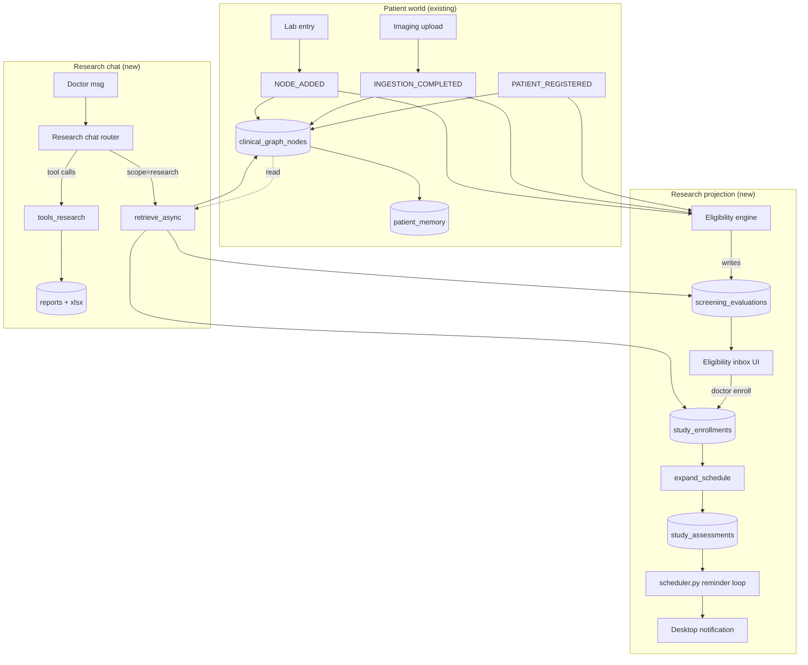

# Research Workspace 设计文档

> **状态**: Design Review v0.1（待医生 + 工程团队 review）
> **作者**: AI 助理；2026-06-15
> **目标读者**: PI 钱东医生及其团队、Rune/Nexus 工程团队
> **关联文档**:
> - `docs/design/IMAGING_PATIENT_ISOLATION_BUGFIX.md`（同期提交的 P0 Bug 报告）
> - `docs/design/m3-memory-architecture.md`（现有记忆架构）
> - `docs/concepts/data-flow.md`（DigitalTwin 9-step chat loop）

---

## 0. 一页摘要

> **🎯 北极星原则（North Star）**
>
> **An AI for research should accumulate, not reset.**
>
> 区别于"再一个医疗 chatbot"的全部价值主张：让每一次 enroll、每一次 confirm、每一次 override 都**沉淀**进系统的判断力，而不是关掉 tab 就消失。
>
> 累积发生在 4 个轴上 —— 每个轴对应已经存在的设计支柱：
>
> | 累积什么 | 怎么承载（设计支柱） | 反 anti-pattern |
> |----------|---------------------|----------------|
> | **病例 (cases)** | `study_enrollments` 永不删除 · Patient timeline 完整保留 · Episodes memory namespace | 不会因为换 session 就忘掉这位患者上次怎么处理 |
> | **Candidates** | `screening_evaluations` 每次评估写**新行**（绝不 update 旧行）· 跨研究并行评估 · 历史 trail 可审计 | 不会因为这次 LLM 改主意就丢掉上次的判断证据 |
> | **决策 (decisions)** | `SCREENING_DECISION_MADE` + `STUDY_OBSERVATION_CONFIRMED` 事件 · Skills namespace 沉淀医生 heuristics | 不会让医生"上次为什么这样判断"变成 lost knowledge |
> | **判断 (judgments)** | Propose → Observe → Verdict → Compound 演化循环 · `scope_tags` 跨 study/patient 双挂 · `VerdictRunner` 跨 cohort 复盘 | 不会让 AI 每次给的建议都"看起来一样"，而是越用越像这位医生 |
>
> 凡是新决策、新 schema、新模块，都要回答：**它累积了什么？怎么累积？**

**核心设计原则（来自医生 review）**：UI/UX **以研究为中心**，Patient Mode 是为研究模式服务的从属视图。Rune 不是"再加一个研究功能"的临床记录工具——它**首先**是一个研究工作台，每位患者都是某个（或多个）研究中的一颗"棋子"。

把现有应用从 "**患者视角 × 单一聊天**" 升级为 "**研究视角为主、患者视角从属 × 双聊天**" 的研究优先架构：

- 应用启动**默认进入 Research Workspace**。顶级 sidebar 是 *My studies*，不是 *Patients*。
- **Patient Mode 仍然保留**（每个患者一个独立 chat，专注个体临床决策），但**入口与导航重心都从研究开始**：医生通常从某研究的 Roster / Safety / Eligibility 卡片**钻入**到某位患者；面包屑始终保留研究上下文（`Hybrid RT 研究 / 张某某`）。
- **顶部仍保留一个 `[ Patient | Research ]` 段控**（决策 D1 已定），让医生在罕见情况下需要直达 "全部患者扁平列表" 时也能切回去——但默认与第一启动着陆都在 Research 一侧。
- 在 Research Workspace 里医生可以：
  1. **管理多个前瞻性研究项目**（Study/Protocol）。
  2. **跨患者**与一个 Research AI 助理聊天，让它"知道全部患者数据但视角是研究的"。
  3. 每当任何患者出现新数据（新建、影像、检验、随访记录），**自动**评估该患者是否命中**任一研究**的入排标准；命中则在 Research Workspace 的 Eligibility Inbox 推送提醒。
  4. 对每条 candidate，医生可以一键查看证据 → 决定 "邀请入组 / 跳过 / 待定"。入组后该患者就出现在研究的 *Enrollment Roster* 里。
  5. 在治疗过程中，按研究协议规定的访视/评估节点（基线、放疗后 4 周、每 3 月 CT…）自动生成待办提醒、记录病情和检查数据。
  6. 任何时刻可以让 Research AI 输出**研究中期报告**或**最终报告草稿**（含表 1 基线特征、KM 曲线占位、毒性表、入排流图等）。

这套设计**完全沿用** Rune 现有的 (a) 事件溯源、(b) per-patient clinical graph、(c) DigitalTwin 长期记忆、(d) Workflow 配方 四个支柱；新增的实体只有：`research_studies`、`study_enrollments`、`study_assessments`、`screening_evaluations`、以及一个 Research-scope 的会话类型。

**做得对的话，医生的研究项目从今天的"散落 Excel + 微信 + PACS 截图"变成一个统一、可审计、可一键生成报告的工作台。**

### 0.1 反 Anti-pattern — 这个产品**绝不**做的事

为了保护北极星原则不被需求漂移侵蚀，下面这条 "不做清单" 与决策清单同等位阶：

- ❌ **不做 Reset chat**。新建对话不等于失忆 —— DigitalTwin memory + EventLog 保证医生上次怎么决策永远找得回。
- ❌ **不做"每次都从零判断"的 chatbot**。auto-rule + auto-llm 评估必须查 Episodes / Skills / 历史 screening row，而不是只看当前 prompt。
- ❌ **不让 AI 替医生拍板**。Stage 3 LLM 给的是 *recommendation*；最终入组、最终 AE 分级、最终报告签字都是医生显式动作。
- ❌ **不删数据**。withdrawn / screen_failed / observation-unlinked 全部用软标记 + 时间戳，原始 timeline 不变。GCP 合规底线。
- ❌ **不在患者邮件 / 患者侧 UI 出现任何研究字眼或诊断细节**（合规优先，§5.2 已落实）。
- ❌ **不引入"为了 demo 好看而绕过医生"的自动化**。任何看似"AI 自动完成"的动作，背后必须能 trace 到一条 `SCREENING_DECISION_MADE` / `STUDY_OBSERVATION_CONFIRMED` / `Invite` 按钮点击。

---

## 1. 用户场景（Use Cases）

以钱东医生团队 3 个正在进行的研究为例（出自附件 `clinical_trial_extract/`）：

| # | 研究 | 阶段 | 入组规模 | 关键阶段 |
|---|------|------|----------|-----------|
| A | **IV 期 NSCLC Hybrid RT + 免疫**（前瞻性、单臂） | I/II 期 | 35 例 | 一线化免 4–6 周期 → SBRT/Low-dose Bath → 免疫维持 |
| B | **ES-SCLC EC + 阿得贝利单抗 + 全残留病灶大分割放疗**（多中心双队列、II 期） | II 期 | 150 例（1:1） | 化免 4–6 周期 → 残留灶大分割（仅试验组） → 免疫维持 |
| C | **不可切除 III 期 NSCLC 中央限域 8 Gy/1f 免疫点火 + cCRT**（单臂、I 期） | I 期 | 6 (run-in) + 24 | 8 Gy/1f → 1 周期 ICI → cCRT 60 Gy/30f → ICI 巩固 |

下列每个 use case 都来自钱医生实际会做的事。

### UC-1 ｜ 新患者进来，自动判断他是否符合任一在研研究

> "李某某, 60 岁男, IV 期肺腺癌, EGFR 阴性, ECOG 1, 一线化免 4 周期后达 PR" — 医生新建 patient + 上传 PET-CT。

期望：
- 在医生还没主动找研究之前，**Research Workspace 的 Eligibility Inbox 自动出现一条** "李某某 命中研究 A 的入选标准 a/b/c/d/e/f；待筛 g/h（知情同意）" 的卡片。
- 卡片明确列出**哪些条目已经从结构化数据自动判定通过**、**哪些条目仍需医生手动确认**（例如知情同意必然是人工 gate）。

### UC-2 ｜ 入组后按方案推进，自动生成访视/评估提醒

> 医生在卡片上点 "邀请入组研究 A"。

期望：
- 该患者出现在研究 A 的 **Enrollment Roster**。
- 系统按照研究 A 的访视表（来自附件抽取的 schedule）**预生成访视提醒**：
  - 放疗结束后 4 周 → 胸部平扫 CT
  - 每 3 月 → 胸部增强 CT + 腹部超声
  - 每 6 月 → 全身骨扫描；腺癌还要头颅增强 MRI
  - 每 1 月 → 心肌酶/肌红蛋白/TFT/肾上腺功能
- 这些提醒挂在 `scheduled_tasks`（已存在，`scheduler.py`）+ Research-scope 的待办列表。
- **Email + Calendar 集成**（依医生 review 提案）：每条访视提醒到点后通过现有的 `email_send.py` 自动发送 **iCalendar (.ics) 会议邀请**：
  - 收件人：医生本人 + 患者（仅在 `patients` 表里登记了 `email_address` 时；否则只发医生）。
  - 邮件 body 是访视清单（CT + 抽血 + ECOG 等）；附件是 .ics，标题形如 *"Hybrid RT 研究 · 张某某 · 3 月随访 (CT 胸部增强)"*。
  - 医生接受后该事件落入医生本机/Google/Outlook 日历，避免要求医生再开 Rune 一遍。
  - 患者侧的邀请也起到温和提醒 + 通知作用，**但患者邮件正文里不放任何研究细节或患者其他临床信息**（仅"您的下次复诊在 X 日"），合规优先。
  - 现状缺什么：(a) `email_send.py` 当前只支持纯文本/HTML，需要加 .ics multipart；(b) `patients` 表需要加 `email_address` 字段 + 入组时勾选"是否愿意通过邮件接收提醒"的知情条目。Phase 3 一并做。
- 患者每次复诊 / 上传新影像 / 录入新检验，**自动**关联到当前研究协议的对应访视节点。

### UC-3 ｜ 治疗过程中做"研究护理"

> 患者在做 cCRT 第 3 周时门诊主诉气紧 + 干咳。

期望：
- 医生在 Patient Mode 正常写 SOAP 病程记录。
- 系统识别这是研究 C 入组患者，**自动把这条病程**复制为一条 *研究观察事件*，分类到研究 C 的 *Safety / Pulmonary Toxicity* 栏目下。
- 触发研究 C 的 DLT 监控规则：是否 ≥3 级肺炎？是否符合"首批 6 例 ≥2 例 DLT 即暂停"的 stop rule？

#### UC-3 研究界面设计：在哪里看？怎么知道是哪位患者？

研究观察事件**不**是给现有 Roster / Schedule tab 加新行就完事 —— 它需要一条独立的"安全性 / 观察事件流"。在 Study Detail 里**新增一个 Safety tab**（位于 Roster 和 Schedule 之间）：

```
─────────────────────────────────────────────────────────────────
 8Gy Ignition cCRT III     ⚙ settings    ⓘ Phase I               
─────────────────────────────────────────────────────────────────
 [ Overview ][ Eligibility ][ Roster ][ Safety ●3 ][ Schedule ]
                                              [ Chat ][ Reports ]
─────────────────────────────────────────────────────────────────
 ▼ Safety / Observations                  [auto-mirror: on ●]
 ─────────────────────────────────────────────────────────────────
 Stop-rule status                                                
 ┌─────────────────────────────────────────────────────────────┐ 
 │ Cohort: run-in (n=6)        DLT events so far:  1 / 2 cap   │ 
 │ Status: ▓▓▓░░░  Safe to continue                            │ 
 └─────────────────────────────────────────────────────────────┘ 
                                                                 
 Filters:  [ All ▾ ] [ G≥3 only ] [ Pulmonary ] [ Last 7d ]      
                                                                 
 ─── 2026-06-14  18:42 ──────────────────────────────────────── 
 ┃ 🚩 Patient #003 · LXX 71M · Run-in cohort        [G2 → ?G3]┃
 ┃                                                              ┃
 ┃ Category    Pulmonary toxicity ▾    (auto-classified)       ┃
 ┃ Source      Patient Mode · SOAP @ 6-14  →  [open original]  ┃
 ┃ Excerpt     "门诊主诉气紧 + 干咳第 3 周；HR 92 SpO2 93%      ┃
 ┃              air. 听诊双下肺爆裂音…"                          ┃
 ┃ AE Grade    [ G1 ] [ G2 ●] [ G3 ] [ G4 ] [ G5 ]  ← 待医生确认┃
 ┃ DLT?        [ Yes ] [ No ●] [ Pending ]                     ┃
 ┃ Linked to   Visit "cCRT week 3" (planned ±3d) ✓             ┃
 ┃                                                              ┃
 ┃ [ Confirm grade ]  [ Re-classify ]  [ Unlink (false match) ]┃
 ┗━━━━━━━━━━━━━━━━━━━━━━━━━━━━━━━━━━━━━━━━━━━━━━━━━━━━━━━━━━━━┛
                                                                 
 ─── 2026-06-12  10:20 ────────────────────────────────────────  
 ┃ Patient #001 · ZXX 65M · Run-in cohort           [G1]       ┃
 ┃ Category    Constitutional · fatigue                         ┃
 ┃ Source      Patient Mode · SOAP @ 6-12  →  [open original]  ┃
 ┃ …                                                            ┃
 ┗━━━━━━━━━━━━━━━━━━━━━━━━━━━━━━━━━━━━━━━━━━━━━━━━━━━━━━━━━━━━┛
```

**每张卡片回答"是谁的病程"用三层并存的标识**：

1. **研究内序号**（`Patient #003`）—— 来自 `study_enrollments.enrollment_seq`，对入组顺序敏感、医生最常用。
2. **缩写 + 年龄 + 性别**（`LXX 71M`）—— 即使在脱敏视图下也保留，足够医生认出"是哪一位"，但不暴露全名。
3. **队列 / 分组标签**（`Run-in cohort`、`Cohort: 试验组`、`Cohort: 对照组`）—— 多臂研究里防混淆。

**Source 行**是关键的可追溯链路：
- 文本写明 *Patient Mode · SOAP @ 6-14*（提示数据怎么进来的，避免医生以为是系统幻觉）。
- `[open original]` 按钮：**单击直接切换到 Patient Mode 的对应患者**，并在右侧 ContextRail 上跳到那条 SOAP，原文高亮。返回时面包屑显示 `← 8Gy Ignition / Safety / #003`。

**反向指示（Patient Mode 侧）**：
- 当一条 SOAP 被镜像到任何研究观察事件后，Patient Mode 的病程列表上对应那条记录会出现一个研究胸牌：
  ```
   2026-06-14 SOAP   〔已镜像 → 8Gy Ignition · Safety · G2 待确认〕
  ```
- 单击胸牌跳回 Safety tab 的该条观察。形成闭环。

**自动归类的可信度**：
- AE 分级 / 类别（`Pulmonary / Cardiac / Hematologic / Constitutional / …`）由 LLM 从 SOAP 文本初判后**显示为待医生确认**，永远不直接当作 confirmed 数据计入 stop-rule。
- 医生点 `Confirm grade` 才把 AE grade 锁定，**才**会进入 DLT 计数与最终报告的 Table 2 安全性表。
- 这条原则与 §8 决策点 D3（"Eligibility 评估调 LLM 给建议但医生决策"）一致：临床安全数据的最终态必须由医生显式确认；AE/DLT 计入数据库前都要医生 Confirm grade。

**误匹配修正**：
- `[ Unlink (false match) ]` 把当前镜像标为误判（例如某条 SOAP 实际是另一研究的患者）。系统记录一条 `MEDIC_CORRECTION` 事件，后续同一类文本不再自动归到该研究。
- 这样既保留 LLM 的初判能力，又把"最终决定权"留在医生手里。

**Patient Mode SOAP 镜像到 Safety 的数据模型**：在 §4 `study_assessments` 的基础上加一张并列表 `study_observations` —— 区别在于 observation 是**事件驱动**（SOAP 一旦保存即触发），不需要 due_at；assessment 是**计划驱动**（schedule_json 展开出来等到点）。两者用同样的 `source_node_ids_json` 关联回原始 `clinical_graph_nodes`，所以同一条 SOAP 既能"完成一个计划访视"又能"产生一条观察"，互不冲突。

### UC-4 ｜ 跨患者聊天

> "把研究 A 已入组 12 例患者中、年龄 >65 岁、ECOG 1、有脑转移的患者列出来，告诉我他们目前的 mPFS 进展"。

期望：
- 在 Research Chat（独立于任何单一患者的窗口）输入上面这句中文。
- AI 给出一张表：4 个匹配患者；每人显示当前随访时长、是否 PD、imaging 链接。
- 表格上方有一段叙事："其中 2 人在治疗后 7.3/8.1 个月 PD；2 人仍未 PD（中位随访 5.4 月）。当前队列 mPFS 估算尚未达到（n 太小）。"
- 表的每个引用都可以**点进对应 Patient Mode**（信任但可验证）。

### UC-5 ｜ 一键生成研究阶段报告 / 数据导出

> "帮我生成研究 A 第一个 interim 报告草稿。"

期望：
- AI 自动产出：
  - Table 1（基线特征：n=12，年龄、性别、组织学、分期、ECOG…）
  - Table 2（治疗暴露：SBRT 病灶数 / 剂量分割分布 / Low-dose Bath 总剂量）
  - Table 3（安全性：≥3 级 AE 列表 + irAE 详情）
  - Figure 1（CONSORT-style enrollment flow）
  - Figure 2（KM PFS/OS 占位，未达 mPFS 时显示数据截尾）
- 导出 `.docx`（沿用现有 `docx` skill 输出）+ 配套的脱敏 `.xlsx` 数据。

---

## 2. 信息架构（IA）：Research-first，Patient 从属于 Research

设计哲学（来自医生 review）：**研究 > 患者**。患者在这个应用里几乎总是"研究 X 的入组者"或"研究 X 的待筛对象"。所以信息架构以研究为中心，患者作为研究内的实体。

```
┌─────────────────────────────────────────────────────────────────┐
│                        Rune Desktop App                          │
├─────────────────────────────────────────────────────────────────┤
│  🏥 Rune     [ Patient | ●Research ]    🔍   👤 Dr. Qian         │
│  ───────                  ▲                                      │
│                           └─ default landing on launch           │
│                                                                  │
│  ▼ Research Workspace (DEFAULT)                                  │
│  ┌──────────────────┬──────────────────────────────────────────┐ │
│  │ Studies sidebar  │ Study Detail (main area)                  │ │
│  │ ──────────────── │ ──────────────────────────────────────── │ │
│  │ + New study      │ [Overview][Eligibility][Roster]           │ │
│  │                  │ [Safety][Schedule][Chat][Reports]         │ │
│  │ My studies       │                                            │ │
│  │ ● Hybrid RT (12) │  ← roster / safety / chat 都可             │ │
│  │ ● ES-SCLC    (4) │     drill into a single patient,          │ │
│  │ ● 8Gy Ign    (2) │     which opens Patient drill-in          │ │
│  │                  │     in-place (breadcrumb keeps research   │ │
│  │ Eligibility (7)  │     context).                              │ │
│  │ Unassigned   (3) │                                            │ │
│  └──────────────────┴──────────────────────────────────────────┘ │
│                                                                  │
│  ▼ Patient Mode (subordinate, reachable via toggle OR drill-in)  │
│  ┌──────────────────┬──────────────────────────────────────────┐ │
│  │  Patients (flat) │ Patient Detail                            │ │
│  │  grouped by study│ ⟪ ← Hybrid RT / 张某某 ⟫  (always shows  │ │
│  │  (default), or   │     enclosing study context as breadcrumb)│ │
│  │  "Unassigned"    │ [Img][Labs][Encounter][SOAP][Chat]        │ │
│  │  group at bottom │                                            │ │
│  └──────────────────┴──────────────────────────────────────────┘ │
└─────────────────────────────────────────────────────────────────┘
```

**三条关键的边界：**

1. **默认入口 = Research Workspace**。Patient Mode 是为研究服务的从属视图：医生在它里面写病程、上传影像、看 timeline，所有这些动作都"反哺"研究（自动入排扫描、SOAP 镜像到 Safety、影像绑定到 Schedule visit）。
2. **Patient Chat 的视野 = 单个患者**。它只能 retrieve / 引用属于该 `patient_hash` 的数据。这是临床决策助理，但其 system prompt 现在带有当前所属研究的协议摘要作为隐性上下文（"你正在帮 Dr X 管理 Hybrid RT 研究的患者张某某；以下是协议要点…"）。
3. **Research Chat 的视野 = 当前选中研究下的所有入组患者 + 待筛患者 + 该研究的协议文本**。它能跨患者聚合，但**只能看到 Doctor 名下的全部患者**（多用户 SaaS 场景下隔离仍按 `user_id`）。

**Patient Mode 在 Research-first IA 下的具体变化：**
- **入口偏置**：从 Research Roster / Safety / Eligibility 卡片点开患者是首选路径；通过顶部 toggle 进入的"扁平 Patients 列表"是兜底（用于罕见的"未入组任何研究的患者"或 ad-hoc 查找）。
- **默认分组**：Patients sidebar 默认按 *enrolled study* 分组（`Hybrid RT (12)` / `ES-SCLC (4)` / `Unassigned (3)`）。"Unassigned" 收纳暂时没入组任何研究的患者。
- **面包屑**：从 research drill-in 进入的 Patient view，breadcrumb 永远显示研究上下文 `⟪← Hybrid RT / 张某某⟫`，单击面包屑回到 Study Detail；从顶部 toggle 直接进入的没有研究面包屑。
- **写病程**：每条 SOAP 保存时如果患者在任何研究里，会自动镜像到该研究的 Safety/Observations 流（见 UC-3 设计）。

**信号机制：**
- 二者都基于同一个底层 `clinical_graph_nodes`、`twin_event_log`、`patient_memory`。差别只在 **retrieval scope** 和 **system prompt persona**。这避免了任何"双写、双库"，并和现有 DigitalTwin（per-user）模型天然对齐。

---

## 3. UI/UX 详细设计

### 3.1 顶级导航变化

当前：`App.tsx:96-115` 的布局是 `GlobalHeader → [PatientsSidebar | (ModeTabs + ActiveMode)]`，且 mode tabs 在 `!activePatient` 时直接不渲染（`layout.tsx:382-385`）。

**改动**:

- `lib/util.ts:60` 的 `ModeKind` union 增加 `'research'`。
- 在 `GlobalHeader` 顶部 logo 右侧增加一个**二段 workspace toggle**（决策 D1 已定，沿用医生 review 意见）：

```
   🏥 Rune          [ Patient | ●Research ]    🔍 search       👤 Dr. Qian
                                ▲
                                └─ default on launch
```

- **新装/重启后默认进入 Research** 一侧；Zustand store 的 `activeWorkspace` 也持久化到 localStorage，但首次启动默认值为 `'research'`。
- 切到 Research workspace 时：
  - 左侧 `PatientsSidebar` 替换为 `StudiesSidebar`。
  - 主区域显示 Study Detail（如果有选中研究）或空态 "请选择或新建研究"。
  - `ContextRail` 显示当前研究的统计/快捷动作。
- 切到 Patient workspace 时：
  - `StudiesSidebar` 替换为按入组研究分组的 `PatientsSidebar`（见 §3.4）。
  - 主区域是单患者 Detail。
- **两侧共享一个面包屑组件**：当 Patient view 是从 Research drill-in 而来时，breadcrumb 显示 `⟪← Hybrid RT 研究 / 张某某⟫`；从顶部 toggle 直接进入则不显示研究面包屑。

> **决策 D1（已与医生在 review 中确认）**：顶部段控（toggle），且**默认进入 Research workspace**。理由：两种工作模式心智差异大，强分割比"列表里多一项"更安全；默认偏置 Research 是因为产品定位是研究优先工作台，Patient 模式是从属服务视图。

### 3.2 Studies Sidebar（Research workspace 的主导航）

这是 app 启动后医生看到的第一个 sidebar。它**取代**了原来作为顶级实体存在的 Patients sidebar——患者不再是顶级实体，而是出现在每条 study 的展开内容里（或在 *Unassigned* 分组里兜底）。

```
┌─────────────────────────────────┐
│  Research                       │
├─────────────────────────────────┤
│  + New study                    │
├─────────────────────────────────┤
│  My studies                     │
│  ▼ ● Hybrid RT NSCLC IV    12  │  ← enrolled / target
│    ├ #001 张XX 65M ✓             │  ← 展开后看到入组者
│    ├ #002 王XX 58F !             │     感叹号 = 有 overdue 访视
│    ├ #003 刘XX 71M               │
│    └ + 9 more                    │
│  ▷ ● ES-SCLC + Adebrelimab  4  │  ← 折叠
│  ▷ ● 8Gy Ignition cCRT III  2  │
│                                  │
├─────────────────────────────────┤
│  Cross-study                     │
│  Eligibility inbox          ⓘ7  │  ← 7 个待筛 candidates
│  Unassigned patients         3  │  ← 未入组任何研究的患者
└─────────────────────────────────┘
```

**点击行为：**
- 单击 study 名 → Study Detail (Overview tab)
- 双击 / 单击展开三角 → 在 sidebar 内就地展开该研究的患者列表
- 单击患者行 → Patient drill-in 视图（面包屑保留 `← <Study Name>`）
- 单击 *Eligibility inbox* → 跨研究 candidate 列表
- 单击 *Unassigned patients* → 那一小组未入组任何研究的患者（顶部 toggle 切到 Patient workspace 也能看到同样的人，但默认看不到 study-bound 患者，避免视觉混淆）

### 3.3 Study Detail（中间主区域）

```
─────────────────────────────────────────────────────────────────
 Hybrid RT NSCLC IV     ⚙ settings    ⓘ Phase I/II    [Export ▾]
─────────────────────────────────────────────────────────────────
 ▼ Tabs                                                          
 [ Overview ][ Eligibility ][ Roster ][ Schedule ][ Chat ][ Reports ]
─────────────────────────────────────────────────────────────────
 ▼ Overview (default)
 
 Status: Enrolling (12 / 35)         Started: 2026-01-15
 ─────────────────────────────────────────────────
 Enrollment progress  [████████░░░░░░░░░░░░] 12/35
 
 Primary endpoint    Safety (radiation/immune pneumonitis ≥G3)
 Median follow-up    5.4 mo (range 0.8 – 11.2)
 
 Recent activity (last 7d)
 • 6-12  candidate added: 李某某 (eligibility 6/8 ✓)
 • 6-11  enrollment: 张某某
 • 6-10  follow-up CT chest: 王某某 — no progression
 • 6-09  AE recorded: 刘某某 G2 radiation pneumonitis
 
 [More ›]
─────────────────────────────────────────────────────────────────
```

#### 3.3.1 Eligibility tab

##### 设计考量：每个研究的入排都不同——UI/数据模型如何承接？

这是核心问题。三个示例研究的入排标准条数与字段都不一样：

| 研究 | 入选条数 | 排除条数 | 特有字段 |
|------|---------|---------|----------|
| Hybrid RT (IV NSCLC) | 7 | 2 | `first_line_cycles` (4-6 周期), `driver_mutation` |
| ES-SCLC + Adebrelimab | 10 | 15 | `valg_stage`, `prior_immunotherapy`, `ANC`, `PLT`, `INR`, `treatment_free_interval_months` |
| 8 Gy/1f Ignition cCRT | 9 | 9 | `central_tumor_safe_for_ignition`, `interstitial_lung_disease` |

设计上把"每个研究都长得不一样"这件事做了 4 处隔离：

**① 规则定义：每研究独立的 JSON schema**

`research_studies.inclusion_json` / `exclusion_json` 是 *该研究自己的* 条目数组（结构见 §4.1）。每条 = `{id, text, kind:'auto-rule'|'auto-llm'|'manual', rule_dsl?, llm_prompt?}`。三种 `kind`：

- **`auto-rule`** — 纯 DSL 可表达的条目（age、ECOG 数值、stage 枚举、driver_mutation 阴性等）。比 LLM 更确定、可复现，不需要解释。
- **`auto-llm`** — 需要看自由文本 / 综合判断的条目（"病人状态适合放疗"、"无活动性感染"、混合病理判定 NSCLC、部分 panel 结果判定驱动基因阴性等）。LLM 读 patient_facts + 相关 SOAP / pathology 报告原文，给 *建议判定* + *理由* + *置信度* + *引用的证据*。
- **`manual`** — 人因 gate（知情同意、研究者主观、家属沟通）。LLM 永远不能擅自勾选。

研究 A 有 7 条，研究 B 有 10 条，研究 C 有 9 条——后端无任何对条目数 / 字段名的硬编码约束。

**② UI：数据驱动地动态渲染，不是硬编码**

上面的 mockup 是 *一个* candidate 卡片的样子，但 `Inclusion a/b/c…` 那些行的**条数与文案**全部来自该研究 `inclusion_json` 的 `.map()`。一个 React 组件 `<CriterionList items={study.inclusion} evaluation={candidate.per_criterion} />` 完全通用，研究 A 渲染 7 行、研究 B 渲染 10 行、研究 C 渲染 9 行，**同一段代码**。

**③ 底层 fact 抽取：共享一个统一的 `patient_facts` 视图**

虽然每研究的规则不同，但所有研究最终**只能引用一个共享的 patient 结构化字段表**（见 §5.1 `get_patient_facts(user_id, patient_hash)`）。这张表第一期包含：

```
age, sex, ecog, smoking_status,
pathology, ihc_markers[], driver_mutations[],
ajcc_stage, valg_stage, oligometastatic, brain_mets, leptomeningeal,
prior_lines[], first_line_cycles, first_line_modality, best_response,
anc, plt, hb, alt, ast, tbil, creatinine, urine_protein, inr,
comorbidities[], active_infection, autoimmune_disease,
ongoing_treatments[], pregnant_or_lactating,
informed_consent_signed_at
```

每条 `rule_dsl` 只能用这些字段。新加一条规则时如果引用了不在表里的字段（例如某研究新要 `EBV_status`），需要先扩 `patient_facts` schema + 加抽取逻辑——这是 *一次* 工程改动，从此所有研究都可以引用新字段。

**④ 评估：跨研究并行、互不干扰**

同一位患者的同一份事实，按 §5.1 的循环 `for study in active_studies: for crit in study.inclusion ∪ exclusion: ...` 独立评估。`screening_evaluations` 表的 PK 是 `(user_id, study_id, patient_hash, evaluated_at)`——天然按研究分行。所以**同一患者会在 Eligibility inbox 里出现在多张卡片**（研究 A、研究 B 各一张），每张卡片显示该研究自己的条目。

**⑤ 缺失字段的降级路径**

如果某研究的某条 `rule_dsl` 引用的字段在 `patient_facts` 里还是空的（如 *NGS panel 还没出结果*、*ECOG 还没评估*）：
- 第一期：该条 criterion 评估为 `unknown`，UI 上显示 `?` + 灰色，整张卡片 `overall_status='partial'`。Eligibility inbox 仍然推送，但提示"待补 N 项数据"。
- 第一期不阻塞医生入组——医生可以自己判断；卡片上的 manual checkbox 用来记录"我已经知道这位的 NGS，可入"。
- 第二期：扩展 *向医生提问* 流（如 "请上传该患者最新 NGS 报告 / 输入 ECOG"）。

**⑥ 协议导入的异质性处理（D7 已调整为批量确认）**

新研究上线时，医生上传 protocol .docx，系统**一次性**调 LLM 把入排标准整体 translate 成 inclusion/exclusion 表草案：

- 每条目自动判定 `kind`：能用受限 DSL（比较、IN、AND/OR、仅引用 `patient_facts` 已有字段）表达 → `auto-rule`；需要看自由文本判断（如混合病理、综合状态）→ `auto-llm`（附 LLM 解读时的 `evidence_sources` 提示）；人因 gate（知情同意、研究者主观）→ `manual`，LLM 不可改。
- 解析完成后医生看到 **一张可编辑表**（左列原文段落 ↔ 右列 AI 草案 + 字段、kind、rule_dsl/llm_prompt），可逐行改也可整张 confirm 入库 —— 不强制逐条点（与 D7 决议一致），但**整张表必须有医生 confirm 动作**才会写入 `research_studies.inclusion_json` / `exclusion_json`，避免 AI 默默生效。
- Confirm 后系统对每条 `auto-rule` 做语法 lint（字段是否存在、DSL 是否合法）；对每条 `auto-llm` 做 evidence_sources 可达性校验；任何一项失败时阻塞 confirm 并提示。

> **决策点（待 review）**：当一个研究有多个 *互斥* arm（如 ES-SCLC 双队列）时，eligibility 是不是只针对入组到主试验、然后再二次判定 arm？倾向是先做 study-level eligibility，arm 分配作为入组后的一个独立步骤（见 D5）。

---

##### 通用 candidate 卡片（任何研究都长这样）

```
─────────────────────────────────────────────────────────────────
 Candidates (7)              [filter ▾]  [auto-scan ●]
─────────────────────────────────────────────────────────────────
 ▼ 李某某 · 60M · 肺腺癌 IV · ECOG 1                 added 6-12 18:42
                                                  evidence ●●●●●●●○●○
   Inclusion  a 年龄 18–70   ✓ 60 岁                            auto-rule
              b ECOG 0–1     ✓ ECOG=1                          auto-rule
              c 病理 NSCLC   ⓘ adenocarcinoma w/ partial      auto-llm
                              squamous features —             conf 0.78
                              LLM 判定符合 ("属于腺鳞癌，
                              方案允许"，引 pathology 2026-05)
              d 驱动基因阴性 ⓘ EGFR/ALK/ROS1/BRAF 阴；KRAS    auto-llm
                              G12C 未检测；LLM 判定 likely    conf 0.62
                              negative，建议补 panel
              e IV 期         ✓ AJCC8 IVA (PET-CT 2026-06-10) auto-rule
              f 一线化免 4-6w ✓ 4 周期 carbo+pem+pembrolizumab auto-rule
              h 知情同意      ⚠ 待医生取得                      manual
   Exclusion  d 驱动基因阳性 ✓ 不命中                            auto-rule
              g 知情同意未签 ⚠ 同上                             manual
   ────────────────────────────────────────────────
   🤖 LLM 综合建议: likely_eligible (overall conf 0.71)
      理由: 7/9 条目通过；条目 c 病理虽混合但符合方案允许的腺鳞癌；
      条目 d 建议补做 KRAS G12C 检测后再正式入组以排除靶向适应症。
      ⚠ 仍需医生取得知情同意后再 Invite。
   ────────────────────────────────────────────────
   [ Discuss in chat ]  [ Invite to enroll ]  [ Skip ]  [ Snooze ]
 ▼ 王某某 · 58F …
 …
```

要点：
- 上方的"Inclusion a/b/c…"内容**来自当前研究的 inclusion_json**——研究 A、B、C 各显示自己条目数；研究 B 会展开成 10 条 + 15 条 exclusion，研究 C 是 9+9。
- 每条 criterion 旁边明确标 `auto-rule` / `auto-llm` / `manual` 三种之一。
- `auto-rule` = pure DSL 比对结构化 facts（见 §5.1 Step 1）。
- `auto-llm` = LLM 读 facts + 相关原始文本（病理报告、SOAP、影像 finding）→ 判定 + 理由 + 置信度 + 引用（见 §5.1 Step 2）。LLM 永远只给 *建议*；不直接拍板。
- `manual` = 系统永远不擅自勾选的人因 gate（知情同意、研究者主观判断、家属沟通）。
- 状态符号：`✓ pass`（auto-rule）、`✗ fail`、`ⓘ` LLM 判定 + 可展开理由、`?` 数据缺失 → unknown、`⚠` 需医生手动确认。
- 卡片底部新增 **🤖 LLM 综合建议** —— LLM 把所有 auto-llm + auto-rule 结果汇总，给出 overall recommendation (`likely_eligible` / `partial` / `ineligible`) + 理由 + 建议下一步动作。**这只是建议，不影响数据库 status，更不会自动入组**。
- **`Discuss in chat`** 把这个 candidate 推到 Research Chat，作为聊天上下文：医生可以问 "他符合不？要不要邀请？我应该和家属怎么聊？"。
- **`Invite to enroll`** 弹出一个简单 dialog 确认入组日期、签知情同意时间 → 写入 `study_enrollments`。
- **`Skip`** 写入 `screening_evaluations` 标记 `decision='excluded'` + reason（这条记录将出现在最终 CONSORT 图里）。
- **`Snooze`** 让卡片在 7 天后再提醒（适合 "可能符合，但还差一项检查待补"）。

#### 3.3.2 Roster tab

```
─────────────────────────────────────────────────────────────────
 Enrolled patients (12)                       [filter ▾] [+manual add]
─────────────────────────────────────────────────────────────────
 # | Patient       | Enrolled  | Tx phase  | Last FU   | AEs(≥G3) | →
───┼───────────────┼───────────┼───────────┼───────────┼──────────┼───
 1 | 张某某 65M    | 2026-01-22 | IO maint  | 2026-06-05 | 0        | ›
 2 | 王某某 58F    | 2026-02-04 | IO maint  | 2026-06-10 | 1 (PnA)  | ›
 3 | 刘某某 71M    | 2026-02-18 | SBRT done | 2026-05-29 | 0        | ›
 ⋮
 [Export CSV] [Export REDCap-flavored]
```

每行点开 = 跳到该患者的 Patient Mode，但带回研究上下文（顶部多一条 breadcrumb "← Hybrid RT 研究 / 张某某"）。

#### 3.3.3 Schedule tab

研究协议的访视表"模板化"展开为每个入组患者的甘特图。

```
                  -1w  Base  1w  2w  4w  3m  6m  9m  12m
─────────────────────────────────────────────────────────────
 张某某 (W18)      ✓    ✓     ✓   ✓   ✓   ✓   ✓   ●   ○
 王某某 (W14)      ✓    ✓     ✓   ✓   ✓   ✓   ●   ○   ○
 ⋮
 
 ● = due now  ○ = future  ✓ = done  ! = overdue
 [Click ● to open visit checklist]
```

点击 `●` 弹出 *Visit checklist*：
```
 张某某 — 3-month follow-up   due 2026-06-12  ! 3 days overdue
 ─────────────────────────────────────
 [✓] Chest CT enhanced
 [ ] Abdominal ultrasound
 [ ] CTCAE re-grade of any ongoing AE
 [ ] Cardiac enzymes / TFT / adrenal panel
 [ ] Document SOAP note
 ─────────────────────────────────────
 [ Open patient chat ]  [ Mark visit complete ]
```

#### 3.3.4 Chat tab — Research Chat

这是医生新需求的核心。**核心定位（来自医生 review）**：Research Chat **是 Patient Chat 的超集 + 强外部知识工具**，不是平行的另一种 AI。具体两条：

1. **Patient Chat 能做的它全都能做**——查一位患者的 timeline、写 SOAP、起 lab order、安排访视、检索 finding。只是这些"per-patient"操作必须**显式 scope 到当前讨论中的患者**（通过 `[聚焦张某某]` 按钮 / `@patient #003` 语法 / 上下文消息确认），不能在医生没指明时自己挑一个写。
2. **强外部公开资料能力**——指南、文献、ClinicalTrials.gov 注册库、药物数据库、CTCAE 字典等是 Research Chat 的**一等公民工具**，而不是 fallback。研究工作的本质就是把当前数据放到外部文献的框架里看。

##### 典型对话场景

```
─────────────────────────────────────────────────────────────────
 Hybrid RT 研究 · Chat       (scope: 12 enrolled + 7 candidates)
─────────────────────────────────────────────────────────────────
                                                                 
  💬  把目前所有入组 ≥3 月的患者列出来，按 PFS 排序，并标出谁
      已经达到 mPFS                                                
                                                                 
  🤖  以下是 12 位入组患者中入组时间 ≥3 月的 8 位（截至 2026-06-15）：
                                                                 
      | 患者   | 入组      | 当前随访 | PD? | 备注                |
      |--------|-----------|----------|-----|---------------------|
      | 张某某 | 2026-01-22 | 4.8 mo   | No  | IO maintenance      |
      | 王某某 … (8 行)                                            
                                                                 
      其中 2 例在 7.3 / 8.1 个月观察到 PD；其余 6 例仍未 PD。当前样本
      量 (n=8) 与方案预设 35 例相比仍较小，mPFS 估计点尚未达到。
      想看 KM 曲线？输入 "show KM"。
                                                                 
      [→ open in cohort view]    [↧ save as snapshot]              
─────────────────────────────────────────────────────────────────
  💬  对比一下我们的 mPFS 趋势与 PACIFIC、CheckMate-816、ASTRUM-005
      的对应数据                                                  
                                                                 
  🤖  …（拉 PubMed + ClinicalTrials.gov 数据 + 你的 cohort，三方对比表）
─────────────────────────────────────────────────────────────────
  💬  张某某 6-14 SOAP 写到一半，帮我把今天主诉补成结构化 SOAP，
      然后归到他在 Hybrid RT 里的 cCRT week-3 visit                
                                                                 
  🤖  [聚焦张某某 (#001)] 已切换到 patient-scope 写入。这是我整理
      出的 SOAP：…  [确认写入]  [取消]                              
─────────────────────────────────────────────────────────────────
  Ask, summarize, draft, search literature, @patient, …
─────────────────────────────────────────────────────────────────
```

##### vs Patient Chat 的关系（重点是相同点，而不是差异）

| 维度 | Patient Chat | Research Chat |
|------|--------------|---------------|
| **System prompt persona** | "你是 Dr X 的临床决策伙伴，专注于当前选中的患者 + 该患者所在研究的协议要点" | "你是 Dr X 的研究助理，视角是研究项目 P；可以跨患者聚合，可以引用外部文献，也可以聚焦到任一患者后做 Patient Chat 能做的一切" |
| **Retrieval scope** | `patient_hash = ?` | 默认 cohort `patient_hash IN (enrolled ∪ candidates)`；用 `@patient #N` 或 `[聚焦张某某]` 后**收窄**到那一位 |
| **Patient-level 工具** | 全部可用（write_soap、order_lab、schedule_visit、annotate_finding、ack_quick_scan、open_imaging…） | **同等可用**，前提是已显式 scope 到具体 patient（在 chat 头部显示 `[聚焦 #001 张XX]` chip）。聚焦后直接写，与 Patient Chat 体验对齐 |
| **Research-level 工具** | 不可用 | cohort_query / draft_report / draft_table_1 / generate_consort / generate_km / export_xlsx / screen_match / what_if_arm_assignment |
| **外部知识工具（一等公民）** | 现状只在 T3/T4 fallback 时调；很轻 | **重度使用**：pubmed_search、ct_gov_search、guideline_lookup（NCCN/CSCO/CSCO BC）、ctcae_v5_lookup、drug_db_query（药物相互作用、剂量调整）、protocol_full_text（当前 study 的 docx）、similar_trials_lookup（在 CT.gov 找同适应症 ongoing/completed 研究） |
| **引用方式** | 引用同一患者的事件 / finding | 每条聚合结果可点进具体患者；每条文献引用包含 PMID / DOI / CT.gov NCT 号 + 关键片段，可一键打开原文 |
| **写操作的安全门** | 直接写 | 写之前必须 `[聚焦 #patient]` 切到单个患者；之后直接写（与 Patient Chat 对齐）。跨患者的**批量**动作（如"给这 3 位都安排明天 8 点抽血"）依然显示一张确认表给医生勾选，避免一次误操作影响多人 |

##### 外部知识工具清单（Research Chat 一等公民）

| Tool | 数据源 | 用途示例 |
|------|--------|---------|
| `pubmed_search` | PubMed E-utilities | "找 3 篇 2023+ 关于 hybrid RT 联合 PD-1 在 IV NSCLC 的文献" |
| `ct_gov_search` | ClinicalTrials.gov v2 API | "在做哪些同类研究？mPFS 报到多少？" |
| `guideline_lookup` | NCCN / CSCO / CSCO-BC 本地缓存 + 在线最新版 | "G3 免疫性肺炎 NCCN 推荐处理？" |
| `ctcae_v5_lookup` | CTCAE v5 字典 | "干咳 + 气紧 + SpO2 93%，分级建议？" |
| `drug_db_query` | OpenFDA + 国家药典 | "卡铂 + 阿德贝利单抗，肾功能 CrCl 45 的剂量调整？" |
| `protocol_full_text` | 该研究自己的 .docx 提取 | "我们方案对 ≥G2 肺炎的暂停规则是什么？" |
| `similar_trials_lookup` | ClinicalTrials.gov + WHO ICTRP | "全球有哪些 hybrid RT phase III 在跑？" |
| `web_search`（兜底） | 现有 Bing/Tavily | 上述结构化源没覆盖的查询 |

工程上：把现有 `web_search.py` 升级为一个**多 source aggregator**，给每个 source 写一个轻量 client（PubMed 是 XML、CT.gov 是 JSON、NCCN/CSCO 走本地 PDF 索引）。结果统一返回 `Citation[]` 形状，retrieval_tiers T4 调用它，answer 里逐条挂引用号。

##### `guideline_lookup` 的具体技术选型

医生 review 提出"医疗指南检索能力可以使用哪个工具？" —— 这是一个**没有完美现成 API** 的领域，需要分层组合。下面是建议的选型，按优先级：

**Tier 1 — 中文肿瘤指南（钱医生临床的主依据）**

| 来源 | 形态 | 访问方式 | 建议处理 |
|------|------|---------|---------|
| **CSCO 指南**（年度更新，肺癌/SCLC/食管癌等 30+ 部） | 官方 PDF + CSCO 指南 app | 公开下载（cnki / CSCO 官网）；app 有 in-app PDF；**无公开 API** | 本地缓存最新版 PDF → PyMuPDF 抽取 → 按章节/表 chunked embed 入 vector_index（新建 `corpus='guideline-cn'` namespace）→ 半年 refresh 一次 |
| **中华医学会临床诊疗指南** | PDF / Web | 公开下载；**无 API** | 同上 |
| **医脉通临床指南** | Web + 移动 app；含中英文综合 | 部分公开，部分需登录；**无公开 API**；可做 web scraping 但有版权风险 | **不主动抓取**；只在医生显式提供 URL 时 fetch 单页用作 citation |

**Tier 2 — 国际肿瘤指南（国际标准 / 与协议对比）**

| 来源 | 形态 | 访问方式 | 建议处理 |
|------|------|---------|---------|
| **NCCN Guidelines** | PDF | 个人注册免费下载；**institutional API 收费**；公共 API 极有限 | 本地缓存（许可范围内）PDF；不内置直接打 NCCN 接口；citation 给出 NCCN PDF 章节锚点 |
| **ESMO Clinical Practice Guidelines** | Web + PDF | 公开 / 免费登录；**有 Crossref DOI**，能通过 PMID/DOI 关联到 PubMed | 直接通过 `pubmed_search` 联动；本地缓存关键肿瘤 PDF |
| **ASCO Guidelines** | Web + PDF | 公开免费；**JCO has REST/DOI** | 通过 PubMed / DOI 检索；不需额外 client |
| **NICE Guidelines (UK)** | Web + JSON-LD | **公开 syndication API** + 结构化数据 | 直接 client（非主要使用，但作为 EU 视角对照） |
| **WHO Guidelines** | PDF | 公开免费；无 API | 偶尔引用即可，不预缓存 |

**Tier 3 — AI/RAG 指南聚合工具（可选第三方）**

| 工具 | 性质 | 适用性 |
|------|------|--------|
| **OpenEvidence** | 免费 AI 搜索，覆盖 PubMed + 指南 | 可作为 fallback 兜底 query；返回有引用的摘要；目前以英文为主，对 CSCO 覆盖弱 |
| **UpToDate** | 付费订阅；机构常买 | **如果医院已经有订阅，可以直接调他们的 REST API**（Wolters Kluwer 提供）；覆盖广、更新快；中文版有限 |
| **DynaMed** | 付费订阅，EBSCO | 类似 UpToDate；机构有授权时可用 |
| **Med-PaLM / 大模型直答** | 大模型自身知识 | **不建议作为权威指南来源**；只作为 phrasing 草案 |

**最终建议（第一期实现）**

```python
@tool
def guideline_lookup(
    query: str,
    sources: list[Literal[
        'csco', 'nccn', 'esmo', 'nice',
        'uptodate',  # only if NEXUS_UPTODATE_API_KEY set
    ]] = ['csco', 'nccn', 'esmo'],
    top_k: int = 5,
) -> list[Citation]: ...
```

后端实现策略：
1. **CSCO + NCCN + ESMO** 走本地缓存的 RAG：
   - 维护一个 `data/guidelines/` 目录，每个机构一个子目录，按 yyyy 年度归档。
   - 启动时跑 `index_guidelines()` 把所有 PDF 切片 → embed → 写入 vector_index 的独立 `corpus='guideline-{org}'`。
   - 查询时按 `sources` 做 SQL `WHERE corpus IN (...)` 过滤。
2. **NICE** 走官方 syndication API（一个轻量 HTTP client）。
3. **UpToDate**：只在 `NEXUS_UPTODATE_API_KEY` 配置时启用；走 Wolters Kluwer REST API。
4. **每条 Citation** 必须包含：`source_org`、`guideline_title`、`year`、`section`、`local_anchor`（PDF 内页码）、`url`（如果有公开 URL）。LLM 在 answer 里挂的引用号 `[1]` 在 UI 上展开为 `CSCO 肺癌指南 2024 · 6.3 免疫治疗不良反应处理 · p.142`。

**法律 / 合规边界**：
- CSCO PDF 可以本地缓存用于内部检索（公开发布）。
- NCCN PDF **个人注册下载用于个人临床参考是允许**的；机构集中再分发需要 institutional license。第一期把 NCCN 缓存做成 **per-doctor 本地 cache**（每位医生的本机各自下载、不在服务器集中存），规避机构再分发问题。
- UpToDate 严格按 API 授权范围使用；不缓存内容只缓存 query→answer 24h。
- 任何来源都不会把指南原文整段塞给患者邮件（合规）。

> **决策点（待 review）**：第一期把 CSCO 作为唯一中文权威源，还是同时把医脉通 / 临床指南网这类聚合站也纳入？倾向是 **只用 CSCO + 中华医学会官方版本**（权威、licensing 干净），不抓取第三方聚合站。

##### 学术期刊检索的技术选型（医生 review 补充）

医生 review 接着问"对应的学术期刊？可以通过什么工具获取" —— 这一层比指南更碎、licensing 更复杂。建议按 **Title/abstract → Open-access 全文 → 引用网络 → 机构订阅** 四层组合：

**Tier J1 — Title/Abstract 检索（已在 `pubmed_search` 覆盖）**

| 来源 | API | 用途 | 备注 |
|------|-----|------|------|
| **PubMed E-utilities** | 公开 / 免费 / 无 key 即可（高频需 NCBI key） | 主要英文医学文献的入口 | 已在 §3.3.4 工具表中 |
| **Europe PMC REST** | 公开 / 免费 | 覆盖 PubMed 之外的更多欧洲 OA 期刊 + preprints | 补充 PubMed 的盲区 |

**Tier J2 — Open-access 全文（关键 — 这才是"我要读全文"层）**

| 来源 | API | 用途 |
|------|-----|------|
| **PubMed Central (PMC)** | NLM E-utilities `efetch?db=pmc` 返回完整 OA JATS XML | 给 PubMed 命中文章拉 OA 全文（如果是 OA） |
| **Unpaywall** | 公开免费 (1M req/day) | 输入 DOI → 返回 OA PDF URL；最简单的"全文获取"路径 |
| **Crossref** | 公开免费 | DOI → 元数据 + 链接；Unpaywall 的上游 |
| **CORE** | 公开 / 注册免费 | 聚合全球 OA repository 全文，覆盖 PMC 之外 |
| **arXiv API** | 公开免费 | 偶尔肿瘤里 ML/影像组学论文 |
| **bioRxiv / medRxiv API** | 公开免费 | **重要** — Hybrid RT / 免疫点火等前沿主题在 preprint 上比正式刊更早出现 |

**Tier J3 — 引用网络 / 同领域发现（"找相关文献"层）**

| 来源 | API | 用途 |
|------|-----|------|
| **Semantic Scholar Graph API** | 公开 / 免费（注册 key 提速） | 引用图谱、similar papers、TLDR 摘要；非常强的"找相关研究"工具 |
| **OpenAlex** | 公开 / 免费 | 现代 MAG 替代品；完整作者/机构/期刊图；适合"该作者其他工作"/"该机构 oncology 研究"分析 |
| **Connected Papers** | Web API（受限） | 可视化论文关系图；可选 |

**Tier J4 — 中文期刊（钱医生临床的核心，但 licensing 复杂）**

| 来源 | 形态 | 访问方式 |
|------|------|---------|
| **CNKI (知网)** | Web + 数据库 | **无公开 API**；医院通常有订阅；可走机构 EZproxy 检索，但不能脚本化抓取（违反 ToS） |
| **Wanfang (万方)** | Web + 数据库 | 同上 |
| **VIP (维普)** | Web + 数据库 | 同上 |
| **中华医学杂志全文数据库** | Web | 机构订阅 |

**建议处理**：第一期**不主动抓 CNKI/Wanfang**（合规风险）；改为：
- 在 UI 上让医生输入 DOI / CNKI 链接后**手动上传 PDF**，Rune 抽文 + 入库（已有 `uploads` 上传链路）。
- 入库后这些 PDF 与本地协议、本地论文一起进入 `corpus='journal-local'` 向量库；Research Chat 引用它们时挂"医生自行上传"出处标签。
- 第二期：如果医院愿意提供 CNKI API key（部分院级订阅有），写一个 `cnki_search(query) → list[Citation]` client。

**Tier J5 — 出版社直接订阅（机构 license 时可用）**

| 来源 | API | 用途 |
|------|-----|------|
| **Elsevier ScienceDirect** | 有 API，需 institutional key | The Lancet Oncology、Cancer Cell 等 |
| **Wiley Online Library** | 有 API，需 key | Cancer、Cancer Medicine |
| **Springer Nature** | 有 API（部分 OA 全文免费） | Nature 系列 |
| **JAMA Network** | 有 API，需 license | JAMA Oncology |

**第一期实现：新增 4 个工具，全部使用 free API**

```python
@tool
def pmc_full_text(pmcid: str) -> FullTextDoc: ...
   # NLM efetch db=pmc; returns sections + figures + tables

@tool
def oa_pdf_lookup(doi: str) -> Optional[OaUrl]: ...
   # Unpaywall + Crossref combo; falls back to None if not OA

@tool
def semantic_scholar_search(
    query: str | None = None,
    paper_id: str | None = None,
    intent: Literal['similar', 'cited_by', 'references'] = 'similar',
    top_k: int = 10,
) -> list[Citation]: ...
   # Use ?paperId= for "papers similar to this one"

@tool
def preprint_search(
    query: str,
    servers: list[Literal['biorxiv', 'medrxiv', 'arxiv']] = ['medrxiv', 'biorxiv'],
    days_back: int = 365,
) -> list[Citation]: ...
   # bioRxiv/medRxiv have very simple JSON REST; arXiv has Atom XML
```

加上前面已有的 `pubmed_search`，**这 5 个工具组合就能覆盖 90% 研究阶段会用到的英文文献检索 + 全文获取**。

**统一 Citation 形状（含期刊上下文）**：

```python
@dataclass
class Citation:
    source: Literal['pubmed', 'pmc', 'europe_pmc', 'biorxiv', 'medrxiv',
                    'arxiv', 'semantic_scholar', 'openalex', 'doi',
                    'csco', 'nccn', 'esmo', 'local_pdf']
    title: str
    authors: list[str]
    venue: str           # 期刊名 / preprint server / 指南机构名
    year: int
    doi: str | None
    pmid: str | None
    pmcid: str | None
    url: str | None       # 原文（OA）或外链
    abstract: str | None
    snippet: str | None   # 与 query 最相关的段落（RAG 命中）
    full_text_available: bool
```

UI 引用脚注示例：`[3] Antonia SJ et al., NEJM 2017, "Durvalumab after chemoradiotherapy in stage III NSCLC", doi:10.1056/NEJMoa1709937 [Open OA PDF]`

**法律 / 合规边界（与指南同理）**：
- PubMed/PMC/Europe PMC/bioRxiv/medRxiv/Unpaywall/Crossref/Semantic Scholar/OpenAlex —— 全部**公开免费 API**，无 licensing 问题。
- 出版社直链：Rune 自己不缓存付费正文；只缓存元数据 + 给医生展示 "open at publisher (institutional access required)" 链接。
- 医生**手动上传**的 PDF：默认只在该医生的本机 corpus 内可见，不汇总到云端（避免跨机构再分发版权问题）。
- 任何文献内容**不会被插入到患者侧邮件 / 患者侧界面**（合规优先）。

> **决策点（待 review）**：是否第一期就接 Semantic Scholar 的 LLM 摘要 (`TLDR`)？非常强大但偶有幻觉。倾向是**接入但 UI 上标 "AI summary by Semantic Scholar"** 与人工 abstract 区分开。

##### 与 DigitalTwin Memory 的集成（医生 review 补充）

医生 review 问"如何从 agent 的 memory 中获取经验，以及跟现有的 memory 设计如何兼容"。这是 Rune 区别于一般 RAG 工具的关键能力：DigitalTwin 已经在按用户长期积累五个 namespace 的经验（详见 `docs/design/m3-memory-architecture.md` 与 `docs/concepts/dpm.md`）。Research Chat **不重做** memory，而是**复用同一个 twin 的 memory，按 research scope 投影读写**。

**Step 0 — 现有 memory 架构回顾**

`nexus_core` SDK 已有 5 个独立版本化的 namespace（`Episodes / Facts / Skills / Persona / Knowledge`），全部由 `DigitalTwin`（per-user）持有，按 propose/commit/rollback 语义演化；`EvolutionEngine` + 4 个 evolver + `VerdictRunner` 已经驱动它们的自演化。每条 memory 已经携带 `patient_hash`（来自 emit 时的事件行）—— 这是关键，意味着我们**不需要新加列**就可以做 research scope 过滤。

**Step 1 — Research Chat 在 retrieval 时读哪些 namespace、用什么 scope 过滤**

| Namespace | Research Chat 怎么用 | scope 过滤策略 |
|-----------|---------------------|----------------|
| **Episodes**（具体事件/案例片段） | "上次遇到类似的 65 岁 ECOG 1 NSCLC IV，您怎么处理 G3 肺炎的？" | scope = `user_id`（医生本人全部经验，跨患者）；**默认按 patient profile 相似度 + 当前 cohort 主题打分**，不限定 `patient_hash` |
| **Facts**（结构化事实） | "您之前标过 #003 刘某某 既往肺结核 cavitation residual" | 双轨：(a) 当 chat 显式 `[聚焦 #N]` 时只读 `patient_hash=#N` 的 facts；(b) 跨患者状态下只读 `patient_hash IS NULL` 或 `scope='study:hybrid-rt'` 的 fact —— 后者承载"研究级泛化事实" |
| **Skills**（医生的临床启发式 / heuristics） | "ECOG 1 + 年龄 >70，您倾向延后 cCRT 一周" | scope = `user_id`；**研究上下文里全量可见**，因为这些是医生本人的通用临床判断 |
| **Knowledge**（医生整理的指南/文献摘要） | "您 2026-03 标记过 PACIFIC 5 年随访关键结论" | scope = `user_id`；**研究里完全可见**；与 §3.3.4 外部 `pubmed_search` 互补：knowledge 是医生人工整理过的，文献是新的检索结果 |
| **Persona** | 让 chat 语气符合医生偏好 | 不动 — 与 Patient Chat 共用 |

**Step 2 — Research session 产生的"经验" 如何回写 memory（保持兼容）**

每次 Research Chat 对话仍然走 9-step chat loop + EvolutionEngine。差别只在两条 tag：

- `nexus_sessions.scope_kind='research'`、`scope_id=<study_id>` 在每条 USER_MESSAGE / ASSISTANT_RESPONSE 事件的 metadata 里透传（已经在 §4.1 加了 scope 列）。
- 4 个 evolver（fact / skill / episode / knowledge）的 `propose` 调用，根据 metadata 自动给新条目打上 `scope='study:<study_id>'` 而非 `patient_hash`。这样：
  - **跨患者的研究级泛化**（例如 *"本研究入组的 65+ ECOG 1 患者，2 周期化免后基线 CRP 显著影响放疗耐受"*）被 evolve 出来时落到 `scope='study:hybrid-rt'` 的 fact 桶里。
  - 患者 chat 不会"看见"研究 chat 派生的 fact，除非 fact 显式跨域 promote（见下）。

不需要新增 namespace，**只多一个 `scope` tag 维度**。`patient_memory` 表已经有 `patient_hash` 字段；加一列 `study_id TEXT NOT NULL DEFAULT ''` 即可承载研究范围。Episodes / Skills / Knowledge 的存储也按同样模式扩列。

**Step 3 — 跨 scope promote / demote**

有时一条研究级 fact 应该回到该患者档案（例如 *"刘某某基线 CRP 偏高，按本研究的经验需密切观察 RT 后炎症反应"* —— 这条既属于研究、又属于患者）。设计：

- 每条 fact 可以有**多个 scope tag**（数据库上落地为 `scope_tags TEXT` JSON 数组）。`scope_tags=['study:hybrid-rt','patient:abc123']`。
- Evolver 在 `propose` 时根据规则判断是否多挂；最终 commit 由 VerdictRunner 验证。
- 这样不再有"双写两份" 的问题。

**Step 4 — Chat UI 里如何显式呈现 "我用了什么记忆"**

Research Chat 的每条 assistant 回答右侧（或下方折叠）显示一组**记忆引用 chip**，让医生信任但可验证：

```
🤖  …推荐对 #003 刘某某 G2 肺炎采用 MP 1mg/kg 起始，每周递减 20%。
    依据：CSCO 2024 指南 §6.3 [1] + NCCN [2] + 您的经验 [E1][E2]

    [1] CSCO 肺癌指南 2024 §6.3 免疫治疗不良反应 p.142
    [2] NCCN NSCLC v2.2025 IO-A-7
    [E1] 您 2025-11-08 处理王某某 G2 肺炎: MP 1mg/kg, recovered W3
    [E2] 您 2026-02-14 处理李某某 G2 肺炎: MP 0.5mg/kg + 改 schedule
    [S1] 应用 skill "G2 IO pneumonitis: start at 1mg/kg if no oxygen requirement"
```

医生单击 `[E1]` 跳到那条 episode 的原始 session；单击 `[S1]` 打开该 skill 的卡片（含已激活的对话历史 + verdict 状态）。

**Step 5 — Memory 反过来影响 eligibility / 报告**

- **Eligibility**：LLM 在 auto-llm 条目评估里可以把"医生历史经验"作为 partial 信号 —— 比如 Skills 表明 *"医生通常对既往 IPF 患者更谨慎"*，LLM 可以在建议里写出来；但**永远不替换 rule_dsl**，更不能自动入组（D3：LLM 给建议，医生决策）。
- **Reports**：起 `draft_interim_report` 时，AI 可以从 `Knowledge` namespace 里捞医生已经写过的研究背景段落直接复用，避免每次都重新生成。

**Step 6 — 与现有 m3 架构的兼容性 check**

| 现有约束 | Research scope 怎么遵守 |
|---------|----------------------|
| DigitalTwin per-user lazy create | 不动 —— 同一 twin 服务多个 scope |
| EventLog 是 user 级 chained log | 不动 —— scope 只是事件 metadata 上的 tag |
| storage bucket 锚定 | 不动 —— 一个 twin 一个 bucket，scope 不影响存储 |
| propose / commit / rollback | 不动 —— 同一通道，scope 只影响 evolver 决策 |
| VerdictRunner 评分 | 增加 scope-aware 视角：研究 fact 的回溯证据看研究内多个患者，不再只看单患者轨迹 |
| 5 namespace 边界 | 不动 —— 不新建 namespace；只在每条目加 scope_tags |

**Step 7 — 隐私 / 患者隔离**

Memory 在 Rune 已经是 per-user，多租户场景下默认就 user-isolated。但要小心：当多个研究在同一医生下时，研究 A 的记忆**默认不可见**给研究 B 的 chat —— 通过 scope_tag 匹配过滤。例外：医生显式开启 "*跨研究共享我个人 skill*" 时才让 skill namespace 跨研究读（默认开；因为 skill 是医生本人的临床判断）。

---

> **决策（✅ 已与医生在 review 中确认）**：
>
> **D16** — 采用 `scope_tags` 多挂模型（一条记忆可同时挂 `study:<id>` + `patient:<hash>`）；VerdictRunner 扩展支持多视角评分。
>
> **D17** — Episode / Skill 默认对 Patient Chat 与 Research Chat 双向可见（医生本人临床经验天然跨场景）；Facts 严格按 scope_tags 过滤，避免具体患者数据误用到不相关上下文。

##### 写操作的安全门（替代旧的"完全不能写"原则）

旧设计是 Research Chat **完全不能**写任何具体患者的临床数据（D2）。这次根据 review 调整为：**可以写，前提是显式 scope 到单个患者**——单患者聚焦后体验与 Patient Chat 完全对齐，不额外加 confirm modal。两道闸：

1. **隐式 multi-patient → 拒绝直接写**：医生没指定患者时，Research Chat 不能写任何 patient-bound 数据；它会主动反问 "您是想写到 #001 张XX 吗？"。
2. **显式 scope 后才解锁 patient 工具**：通过 `[聚焦 #N]` 按钮 / `@patient #N` 语法 / 显式点开右侧的 patient chip 后，chat 头部出现 `🎯 写入将归属于 #001 张XX` 提示带，patient-level 工具才暴露给 LLM；之后**直接写**，不再额外 confirm（与 Patient Chat 体验对齐，避免多余的弹窗）。

**例外（保留 confirm）**：**跨患者的批量写**（一句话给多位患者同时下医嘱 / 安排同一时间抽血等）仍要一张勾选表确认，因为一次操作覆盖多人，风险面不一样。

> **设计原则修订**：Research Chat 不是"只读 + 报告生成"，而是"全能 Patient Chat + 跨患者视角 + 强外部文献"——把研究工作里所有"对内"和"对外"的知识查询都在一个界面里做。单患者写操作的安全性靠 *显式 scope* 即可；额外的 confirm 反而是噪声。

#### 3.3.5 Reports tab

```
─────────────────────────────────────────────────────────────────
 Reports & Exports
─────────────────────────────────────────────────────────────────
 Generated reports
 • 2026-04-30  Interim safety report (n=8)         [open] [.docx]
 • 2026-01-15  Study kickoff baseline             [open] [.docx]
 
 Quick actions
 ┌──────────────────────────┐  ┌──────────────────────────┐
 │  📊 Generate interim     │  │  📤 Export deidentified  │
 │     report (.docx)        │  │     dataset (.xlsx)      │
 │                          │  │                          │
 │  Includes Table 1 / AEs/ │  │  PHI scrubbed; one row   │
 │  KM placeholders.        │  │  per patient × visit.    │
 └──────────────────────────┘  └──────────────────────────┘
 
 ┌──────────────────────────┐  ┌──────────────────────────┐
 │  📐 CONSORT diagram      │  │  ✍ Manuscript draft      │
 │  (SVG/PNG)               │  │  (.docx, structured IMRaD)│
 └──────────────────────────┘  └──────────────────────────┘
```

### 3.4 Patient drill-in 视图（Research 的从属视图）

在 Research-first IA 下，Patient Mode 不再是与 Research 并列的"另一个世界"——它是研究内某一具体患者的细节视图，其设计**主要服务于研究目的**。三处具体变化：

**① 面包屑（永远在场）**

```
⟪← Hybrid RT 研究 / Roster / 张XX (#003)⟫     [Imaging][Labs][Encounter][SOAP][Chat]
```

- 从 research 钻入时显示完整面包屑；单击任一段返回上一层 study 视图。
- 从顶部 toggle 切到 Patient workspace 后再选患者（罕见路径），breadcrumb 退化为 `⟪← All patients / 张XX⟫`，但只要患者属于某研究，面包屑右侧仍显示研究胸牌（见下）。

**② 研究胸牌（chip）**

在 `PatientCard` 顶部、姓名右侧：

```
   张XX · 65M ·  〔Hybrid RT 研究 · enrolled 2026-01-22 · #001〕  〔ES-SCLC · screening〕
```

- 单击胸牌跳回对应研究的 Roster / Eligibility。
- 多研究归属时同时显示多个胸牌。
- 胸牌是**只读引用**：不能在 Patient 内修改研究状态（避免数据归属混乱），研究状态修改始终在 Research Workspace 里完成。

**③ 各 tab 顶部的研究横幅与下推操作**

研究项目要求医生做的事情**主动浮现**在 Patient view 里：

- *Imaging* tab：若按 schedule 该患者**即将**或**已**到 imaging 访视点，顶部横幅显示
  > 下次研究随访: 胸部增强 CT (due in 5 days, per Hybrid RT 研究) — `[ Mark planned ]` `[ Skip with reason ]`
- *Labs* tab：同上，显示研究协议要求的下次抽血面板。
- *Encounter / SOAP* tab：写完一条 SOAP 保存时，如果患者属于研究，弹一条 toast：
  > 已镜像到 Hybrid RT 研究 · Safety / Pulmonary（自动初判 G2，待确认）— `[ Open in Safety ]` `[ Don't mirror ]`
- *Chat* tab：Patient Chat 的 system prompt 自动注入当前所属研究的协议要点摘要，让 AI 在回答时已经"知道"该患者所在研究的入排标准与访视要求；医生可以用 `/protocol` 命令显式调出协议全文。

**Patients workspace（顶部 toggle 切过去后看到的）**

只有当医生显式切换到 Patient workspace 时才能看到一个"扁平 Patients 列表"。默认分组依然是 *按入组研究分组*：

```
┌─────────────────────────────────┐
│  Patients                       │
├─────────────────────────────────┤
│  + New patient                   │
├─────────────────────────────────┤
│  Hybrid RT NSCLC IV         12  │ ▾  ← 默认展开 active 研究
│   #001 张XX 65M                  │
│   #002 王XX 58F !                │
│   ⋮                              │
│  ES-SCLC + Adebrelimab       4  │ ▷
│  8Gy Ignition cCRT III       2  │ ▷
│  Unassigned                  3  │ ▾
│   李XX 60M (under screening)     │
│   ⋮                              │
└─────────────────────────────────┘
```

- 这里**没有研究入组动作**——研究相关操作都要回 Research workspace 完成。Patient workspace 是给"我就想找李某某看看上次 CT" 这种 ad-hoc 场景用的。
- 同一患者属于多个研究时在多个分组里都出现，前面挂一个 `↗` 图标提示"另在 N 个研究中"。

##### 患者数据结构里的"研究参与记录"（医生 review 补充）

医生 review 问"每一个患者的数据结构是不是也应该包含是否正在参与某项研究或者参与过某项研究的记录？" —— 答案是**应该有，但用派生视图实现**，不在 `patients` 表上加冗余列。

**设计选择**：单一事实源 = `study_enrollments` 表；patients 视图通过 join 派生出"研究参与状态"。原因：
- 多研究、多次入组/退出/重新入组的情况，冗余列会立刻陷入一致性维护噩梦。
- `study_enrollments` 已经有 `status / enrolled_at / withdrawn_at / withdrawal_reason / consent_signed_at` 全字段；同时 `STUDY_ENROLLED` / `STUDY_WITHDRAWN` 事件在 EventLog 里完整记录，replay 即可重建任意时刻的状态。
- 加冗余列会让"哪个是真值"变得模糊；保持派生意味着永远不会出现 patients 表说 enrolled、study_enrollments 表说 withdrawn 的冲突。

**API 层把派生关系做成 first-class 字段**：

```python
# GET /api/v1/patients/{patient_hash}  → 已经存在的端点，扩字段：

class PatientDetail(BaseModel):
    patient_hash: str
    initials: str
    age_group: str
    sex: str
    # ...现有字段...

    # 新增：研究参与记录（派生自 study_enrollments + STUDY_* 事件）
    studies: list[StudyMembership]                # current + historical

class StudyMembership(BaseModel):
    study_id:           str
    study_short_code:   str       # e.g. 'HybridRT-IV'
    study_display_name: str
    status:             Literal[
        'screening',              # 在 candidates 里，未 invite
        'invited',                # 已 invite，知情同意中
        'enrolled',               # 入组中（active）
        'completed',              # 研究随访结束
        'withdrawn',              # 退出
        'screen_failed',          # 筛失败
    ]
    enrollment_seq:     int | None
    arm:                str | None  # 多 arm 研究里的分组（若有，见 D5）
    enrolled_at:        int | None
    withdrawn_at:       int | None
    withdrawal_reason:  str | None
    consent_signed_at:  int | None
```

**UI 上 patient 视图里直接展示研究记录**：

```
┌─ Patient detail: 张XX · 65M ─────────────────────────────────┐
│                                                              │
│  Studies                                                      │
│  ────────────────────────────────────────                    │
│   ● Hybrid RT NSCLC IV   #001 · enrolled 2026-01-22 (active) │
│   ○ ES-SCLC + Adebreli   screen_failed 2025-11-04            │
│      reason: ECOG=2 at enrollment window                     │
│                                                              │
│   [Add to a study →]   (jumps back to Research Eligibility) │
└──────────────────────────────────────────────────────────────┘
```

并且在 Patients sidebar 的每一行也把研究状态显示成 chip：

```
│  Unassigned                  3  │ ▾
│   李XX 60M  〔screening · Hybrid RT〕            │
│   赵XX 72F  〔ex Hybrid RT · withdrawn 2025-11〕 │
│   孙XX 55M                                       │  ← 真正未与任何研究关联
```

> "Unassigned" 这一组的含义因此精确化为：**当前没有 `enrolled`/`invited`/`screening` 状态的患者**。`withdrawn` / `screen_failed` 的患者不算 unassigned —— 他们有研究历史，只是没有 active 关联。

**时间线 / 病程也带研究事件**：

`Patient detail · Timeline` tab 把 `STUDY_ENROLLED` / `STUDY_WITHDRAWN` / `SCREENING_EVALUATED(decision=excluded)` 当成普通时间线事件渲染（带研究 logo + 跳转链接）。这样医生回看一位老患者时，会看到"2025-11 进入 ES-SCLC 筛选 → 11-04 排除（ECOG=2）→ 2026-01 进入 Hybrid RT 筛选 → 01-22 入组" 的完整研究履历。

**clinical_graph 里要不要加 study membership 节点？**

倾向**不加**。`clinical_graph_nodes` 是 *per-patient* 临床数据的图；研究归属在概念上不属于该图。若 Research Chat 需要在做某条 query 时把"该患者在研究 X 里"作为上下文喂给 LLM，从 `study_enrollments` join 即可，不需要冗余复制到图。

---

## 4. 数据模型

### 4.1 新增表

> **本节是数据模型的 single source of truth**。任何新增字段必须先回写到这里，再写到 §5 / §6 / §7 prose。
> 与 `packages/server/nexus_server/migrations/versions/0004_research_workspace.py` 保持 byte-identical。

所有新表都遵守现有规约：`user_id` 是多租户 key，所有 PK 形如 `(user_id, *)`。**所有删除操作都是软删除 + 时间戳**（"不删数据"原则，对应 §0.1 anti-pattern 第 4 条）。

#### `research_studies`

```sql
CREATE TABLE research_studies (
  user_id              TEXT NOT NULL,
  study_id             TEXT NOT NULL,        -- e.g. 'hybrid-rt-nsclc-iv'
  display_name         TEXT NOT NULL,
  short_code           TEXT NOT NULL,        -- e.g. 'HybridRT-IV'
  phase                TEXT NOT NULL DEFAULT '',
  status               TEXT NOT NULL DEFAULT 'draft',   -- draft|enrolling|closed|paused
  target_n             INTEGER,
  protocol_doc_id      TEXT,                 -- → uploads.file_id of the protocol .docx
  protocol_text        TEXT,                 -- extracted full text for retrieval
  protocol_summary     TEXT,                 -- LLM-distilled executive summary
  primary_endpoint     TEXT,
  secondary_endpoints_json  TEXT NOT NULL DEFAULT '[]',
  inclusion_json       TEXT NOT NULL DEFAULT '[]',  -- list of {id, text, kind:'auto-rule'|'auto-llm'|'manual', rule_dsl?, llm_prompt?, evidence_sources?}
  exclusion_json       TEXT NOT NULL DEFAULT '[]',  -- same shape
  schedule_json        TEXT NOT NULL DEFAULT '[]',  -- list of {label, offset_days, assessments[], repeat_every_days?, repeat_until_days?}
  stop_rules_json      TEXT NOT NULL DEFAULT '{}',  -- {dlt_cap_run_in, max_g3_pneumonitis_pct, …}
  arms_json            TEXT NOT NULL DEFAULT '[]',  -- D5: multi-arm studies (e.g. ES-SCLC has trial/control)
  engine_config_json   TEXT NOT NULL DEFAULT '{}',  -- D19-D22: per-study tunable thresholds (see §4.4)
  created_at           INTEGER NOT NULL,
  updated_at           INTEGER NOT NULL,
  archived_at          INTEGER,              -- soft-delete (D9 + anti-pattern: never DROP rows)
  PRIMARY KEY (user_id, study_id)
);

CREATE INDEX idx_research_studies_user ON research_studies(user_id, status);
```

`inclusion_json` 示例（对应 Hybrid RT 研究入选标准 a-h）：

```json
[
  { "id": "incl_a", "text": "年龄 18–70 岁", "kind": "auto",
    "rule_dsl": "patient.age >= 18 AND patient.age <= 70" },
  { "id": "incl_b", "text": "ECOG 0–1", "kind": "auto",
    "rule_dsl": "patient.ecog IN (0, 1)" },
  { "id": "incl_h", "text": "患者或家属签署知情同意书", "kind": "manual",
    "rule_dsl": null }
]
```

`rule_dsl` 是一种受限的可读规则。第一期可以简单到只支持比较运算 + IN + 已知字段（age/sex/ecog/staging/biomarkers）。后期再加 LLM-assisted 解析自由文本。

#### `study_enrollments`

```sql
CREATE TABLE study_enrollments (
  user_id              TEXT NOT NULL,
  study_id             TEXT NOT NULL,
  patient_hash         TEXT NOT NULL,
  enrollment_seq       INTEGER NOT NULL,     -- 1, 2, 3, ... per study (re-enrollment preserves seq)
  status               TEXT NOT NULL,        -- enrolled|withdrawn|completed|screen_failed
  arm                  TEXT,                 -- D5: multi-arm allocation (NULL for single-arm)
  enrolled_at          INTEGER NOT NULL,
  withdrawn_at         INTEGER,
  withdrawal_reason    TEXT,
  consent_signed_at    INTEGER,
  baseline_completed_at INTEGER,
  completed_at         INTEGER,              -- when status transitions to 'completed'
  screen_failed_at     INTEGER,              -- when status transitions to 'screen_failed'
  protocol_version_at_enroll TEXT,           -- §9 risk: pin the protocol version this patient enrolled under
  notes                TEXT,
  PRIMARY KEY (user_id, study_id, patient_hash)
);

CREATE INDEX idx_study_enrollments_patient ON study_enrollments(user_id, patient_hash);
CREATE INDEX idx_study_enrollments_study_status ON study_enrollments(user_id, study_id, status);
```

**State machine** (D9 finalized):

```
                ┌──── invited ────┐                ┌── completed
   pending ────┤                  ├── enrolled ───┤
   (screening) └─ screen_failed ──┘                └── withdrawn
```

- `pending` lives only on the `screening_evaluations` row (decision column) — not on enrollments.
- `screen_failed`: medic clicks Skip with reason; sets `decision='excluded'` on `screening_evaluations` AND inserts `study_enrollments` row with `status='screen_failed'` + `screen_failed_at`. *Why also insert into enrollments?* Because CONSORT needs the denominator; we cannot recover screen-failures from screening rows alone (some patients never get a screening row).
- `withdrawn` → can `re-enroll` (status flips back to `enrolled`, `enrollment_seq` preserved).
- `completed` → terminal. Triggers report generation eligibility.

> Patient 是按 `patient_hash` 引用的（沿用现有约定，不引入新 PK）。

#### `screening_evaluations`

承载 *Candidate 累积* 轴（§0 北极星）—— **每次重评估写新行，绝不 UPDATE 旧行**。

```sql
CREATE TABLE screening_evaluations (
  user_id              TEXT NOT NULL,
  study_id             TEXT NOT NULL,
  patient_hash         TEXT NOT NULL,
  evaluated_at         INTEGER NOT NULL,
  triggered_by_event_id   TEXT,              -- twin_event_log row id (full audit trail)
  per_criterion_json   TEXT NOT NULL,        -- {<crit_id>: {kind, verdict, confidence?, reasoning?, evidence_refs?[]}}
  overall_status       TEXT NOT NULL,        -- likely_eligible|partial|ineligible|manual_review
  llm_recommendation_json  TEXT,             -- {overall_confidence, narrative, suggested_next_steps[], model, latency_ms}
                                              -- NULL when overall_status determined purely by auto-rule + manual
  decision             TEXT NOT NULL DEFAULT 'pending',  -- pending|invited|enrolled|excluded|snoozed
  decision_at          INTEGER,
  decision_by          TEXT,
  decision_reason      TEXT,
  snooze_until         INTEGER,              -- D7 snooze: re-surface after this timestamp (epoch ms)
  PRIMARY KEY (user_id, study_id, patient_hash, evaluated_at)
);

CREATE INDEX idx_screening_study_decision  ON screening_evaluations(user_id, study_id, decision, evaluated_at);
CREATE INDEX idx_screening_patient         ON screening_evaluations(user_id, patient_hash, evaluated_at);
```

最新一条是当前显示状态，旧的保留作审计 trail。`llm_recommendation_json` 显式记录 LLM 用的模型、延迟、给出的 narrative —— 既是审计要求，也是后期评估 LLM 准确率的数据源（D3 + §9 风险对策）。

#### `study_assessments`

承载 *计划访视追踪*。每个 enrollment 触发 `expand_schedule()` 一次性展开为多条行。

```sql
CREATE TABLE study_assessments (
  user_id              TEXT NOT NULL,
  study_id             TEXT NOT NULL,
  patient_hash         TEXT NOT NULL,
  visit_id             TEXT NOT NULL,        -- e.g. 'baseline+0d' | 'rt_end_4w+28d' | 'fu_3m+90d'
  assessment_kind      TEXT NOT NULL,        -- imaging_ct | lab_panel | ecog | ae_review | soap | …
  status               TEXT NOT NULL DEFAULT 'planned',  -- planned|in_progress|completed|missed
  due_at               INTEGER NOT NULL,
  completed_at         INTEGER,
  source_node_ids_json TEXT NOT NULL DEFAULT '[]',  -- clinical_graph_nodes refs that completed this visit
  notes                TEXT,                 -- includes 'reminder_fired:<ms>' bookkeeping marker
  PRIMARY KEY (user_id, study_id, patient_hash, visit_id, assessment_kind)
);

CREATE INDEX idx_study_assessments_due     ON study_assessments(user_id, due_at, status);
CREATE INDEX idx_study_assessments_roster  ON study_assessments(user_id, study_id, patient_hash);
```

#### `study_observations`

承载 *event-driven 安全观察事件流* (UC-3)。区别于 `study_assessments`：observation 是事件驱动（SOAP / lab / finding 发生即触发），没有 `due_at`。

```sql
CREATE TABLE study_observations (
  observation_id           TEXT PRIMARY KEY,
  user_id                  TEXT NOT NULL,
  study_id                 TEXT NOT NULL,
  patient_hash             TEXT NOT NULL,
  created_at               INTEGER NOT NULL,
  category                 TEXT NOT NULL,    -- Pulmonary|Cardiac|Hematologic|Constitutional|GI|…
  ae_grade                 TEXT,             -- G1|G2|G3|G4|G5 (CTCAE v5)
  ae_grade_confirmed       INTEGER NOT NULL DEFAULT 0,   -- 0 = LLM proposed; 1 = medic confirmed (D3 invariant)
  is_dlt                   INTEGER,          -- NULL until medic decides
  source_kind              TEXT NOT NULL,    -- soap_mirror | lab | finding | imaging_finding | manual
  source_node_id           TEXT,             -- clinical_graph_nodes.node_id
  source_text_excerpt      TEXT,
  llm_classification_json  TEXT,             -- {category_conf, ae_grade_conf, reasoning, model, latency_ms}
  linked_assessment_visit_id  TEXT,          -- optional: ties to the visit window this observation falls in
  medic_confirmed_at       INTEGER,
  unlinked_at              INTEGER,          -- soft-delete: medic marked as false-match (D3 anti-pattern: never DROP)
  unlink_reason            TEXT
);

CREATE INDEX idx_study_obs_study    ON study_observations(user_id, study_id, created_at DESC);
CREATE INDEX idx_study_obs_patient  ON study_observations(user_id, patient_hash, created_at DESC);
```

#### `nexus_sessions` — 新增 scope 列

复用现有表，新增字段把 chat session 标记为 patient-scope 还是 research-scope。

```sql
ALTER TABLE nexus_sessions ADD COLUMN scope_kind TEXT NOT NULL DEFAULT 'patient';   -- 'patient' | 'research'
ALTER TABLE nexus_sessions ADD COLUMN scope_id   TEXT NOT NULL DEFAULT '';          -- patient_hash 或 study_id
-- 回填: WHERE scope_kind='patient' AND scope_id='' SET scope_id = patient_hash
```

#### `patient_memory` / Memory namespace 表 — 新增 `scope_tags`（D16）

```sql
ALTER TABLE patient_memory  ADD COLUMN scope_tags TEXT NOT NULL DEFAULT '[]';
-- D17: Episodes / Skills / Knowledge 三个 namespace 表同样加 scope_tags 列。
-- 当前 0004 migration 只覆盖 patient_memory；Phase 7 完成时把另外三个 namespace
-- 表的 scope_tags 列也加上（建议 migration 0005）。
```

`scope_tags` 是 JSON 数组，元素形如 `study:<id>` 或 `patient:<hash>`。一条记忆可多挂（D16）。

#### `patients` — 新增 email 字段（Phase 3，D13）

```sql
ALTER TABLE patients ADD COLUMN email_address           TEXT    NOT NULL DEFAULT '';
ALTER TABLE patients ADD COLUMN email_reminder_consent  INTEGER NOT NULL DEFAULT 0;  -- 0/1 boolean
```

医生侧邮箱建议挂在 `users` 表，但 `users` 表是 framework 层；若 framework 不允许加列，Phase 3 时在 `research_studies.engine_config_json` 里加 `doctor_email` 字段作为兜底（见 §4.4）。

### 4.4 `engine_config_json` — 把 magic numbers 钉死成 per-study 配置

review 阶段发现代码里散落多个临床安全旋钮（confidence 阈值、auto-link 窗口、snooze 默认天数等），但都是硬编码常量。这违反了"医生掌控"原则。**所有这些必须挂进 `research_studies.engine_config_json`**，protocol 导入确认页上让医生显式设值；未设则用全局 default（见下方"全局 default"列）。

| Key | 含义 | 全局 default | 来自决策 |
|-----|------|------------|----------|
| `confidence_threshold_pass` | LLM verdict='pass' 但 confidence 低于此值时自动 demote 为 unknown | `0.40` | D19 |
| `confidence_threshold_fail` | LLM verdict='fail' 同理，低于此值不直接 fail，转为 unknown 让医生看 | `0.50` | D19 |
| `auto_link_window_days` | NODE_ADDED → study_assessment 自动 link 的 ±天数窗口 | `7` | D20 |
| `reminder_lead_hours` | 访视到点前多少小时发 .ics 邀请 | `24` | D20 |
| `overdue_grace_days` | 访视过期多少天后标记 missed | `7` | D20 |
| `snooze_default_days` | Eligibility inbox snooze 默认天数 | `7` | D21 |
| `llm_judge_min_agreement_pct` | Phase 2 联调期间 LLM-医生一致率低于此值时停用 auto-llm | `85` | D22 |
| `external_kb_cache_ttl_hours` | PubMed / Unpaywall / Semantic Scholar 等本地 cache TTL | `24` | D22 |
| `verdict_observation_n_events` | VerdictRunner 复盘前观察的事件数下限 | `3` | D22 |
| `doctor_email` | 医生侧邮箱（用于 .ics 邀请的 From / Organizer） | `""` | D13 兜底 |

**示例 — 8 Gy Ignition phase-I 研究的配置**（更严格）：

```json
{
  "engine_config_json": {
    "confidence_threshold_pass": 0.65,
    "auto_link_window_days": 2,
    "reminder_lead_hours": 48,
    "verdict_observation_n_events": 6,
    "llm_judge_min_agreement_pct": 90
  }
}
```

Phase-I 研究比 Phase-II/III 安全边界更窄，所以阈值更紧。Hybrid RT (I/II) 可用全局 default。

实现注记：所有读取这些 key 的代码（`eligibility.py` / `schedule.py` / `external_knowledge.py`）必须走一个 `get_engine_config(study_id)` helper —— 它先读 `engine_config_json`，缺失字段 fall back 到全局 default。**绝不允许**模块内继续保留硬编码常量。

### 4.2 新增事件类型（event sourcing）

在 `event_sourcing/event_kinds.py` 增加 **14 个事件类型**（与代码 byte-identical）：

| Event kind | patient_scoped | 关键 payload | 触发场景 |
|-----------|----------------|--------------|----------|
| `STUDY_CREATED` | ✗ | study_id, display_name, short_code, phase, target_n, primary_endpoint | 医生新建研究（或 starter 安装） |
| `STUDY_PROTOCOL_UPDATED` | ✗ | study_id, inclusion_json, exclusion_json, schedule_json, arms_json, stop_rules_json | 协议规则编辑（保留 audit） |
| `STUDY_ARCHIVED` | ✗ | study_id, reason | 软删除研究 |
| `SCREENING_EVALUATED` | ✓ | study_id, per_criterion_json, overall_status, llm_recommendation_json | 每次重评估 |
| `SCREENING_DECISION_MADE` | ✓ | study_id, decision, reason, snooze_until | 医生 Invite / Skip / Snooze |
| `STUDY_ENROLLED` | ✓ | study_id, enrollment_seq, arm, consent_signed_at | 入组确认 |
| `STUDY_WITHDRAWN` | ✓ | study_id, reason | 退出 |
| `STUDY_ASSESSMENT_PLANNED` | ✓ | study_id, visit_id, assessment_kind, due_at | 入组后批量预生成 |
| `STUDY_ASSESSMENT_COMPLETED` | ✓ | study_id, visit_id, assessment_kind, source_node_ids | 检查/复诊/写病程后触发 |
| `STUDY_ASSESSMENT_MISSED` | ✓ | study_id, visit_id, assessment_kind | 过期未做 |
| `STUDY_OBSERVATION_RECORDED` | ✓ | observation_id, study_id, category, source_kind, ae_grade?, llm_classification_json | SOAP/lab/finding 自动镜像到 Safety stream |
| `STUDY_OBSERVATION_CONFIRMED` | ✓ | observation_id, ae_grade, is_dlt | 医生确认 AE 分级 + DLT 判定 |
| `STUDY_OBSERVATION_UNLINKED` | ✓ | observation_id, reason | 医生标记为误判 |
| `STUDY_REPORT_GENERATED` | ✗ | study_id, report_kind, file_id, rendered_at | 生成报告事件 |

所有这些都和现有 NODE_ADDED/EDGE_ADDED 并行，**不污染**患者级的 clinical graph。`patient_scoped=✓` 的事件要求 `patient_hash` 不为空（payload validation 在 emit 时强制）。

### 4.3 与现有表的关系图

```
                        ┌─────────────────┐
                        │ research_studies│
                        └────┬────────────┘
                             │ 1:N
                  ┌──────────┴──────────┬─────────────────┐
                  ▼                     ▼                 ▼
        ┌──────────────────┐  ┌───────────────────┐ ┌─────────────────┐
        │ study_enrollments │  │screening_evaluations│ │study_assessments│
        └────────┬─────────┘  └─────────┬──────────┘ └────────┬────────┘
                 │ ref (patient_hash)   │                     │
                 ▼                      ▼                     ▼
       ┌─────────────────────────────────────────────────────────┐
       │                       patients                            │
       │             (existing — keyed by patient_hash)            │
       └─────────────────────────────────────────────────────────┘
                                  │
                                  ▼
              ┌────────────────────────────────────────┐
              │ clinical_graph_nodes / patient_memory  │  ← unchanged
              │ twin_event_log (per-user)              │
              └────────────────────────────────────────┘
```

---

## 5. 关键流程

### 5.1 Eligibility 自动评估流程

**触发条件**: 任何一个会改变患者结构化字段的事件，都触发 *研究入组重评估*。

事件钩子（在 `event_sourcing/handlers.py` 注册）:

- `PATIENT_REGISTERED` → 评估全部 active 研究
- `INGESTION_COMPLETED`（影像入库结束） → 评估全部 active 研究
- `NODE_ADDED`（特别是 finding / lab / stage / biomarker / encounter） → 评估全部 active 研究
- `FINDING_ACCEPTED_BY_MEDIC` → 重评估
- `MEDIC_CORRECTION` → 重评估
- 手动按 "Re-scan all candidates" 按钮 → 重评估

**评估过程**（在新模块 `nexus_server/research/eligibility.py`），分**三阶段**（rule → LLM → overall）：

```
for study in active_studies:
    if patient_hash already in study_enrollments where status='enrolled': skip
    if patient_hash already has screening row decided='excluded' AND no new evidence: skip
    per_criterion = {}

    # ── Stage 1: auto-rule (pure SQL DSL) ─────────────────────────
    # 确定的、可复现的、便宜的部分先做完，作为 Stage 2 的输入上下文。
    for crit in study.inclusion_json + study.exclusion_json:
        if crit.kind == 'auto-rule':
            per_criterion[crit.id] = {
                'kind': 'auto-rule',
                'verdict': evaluate_dsl(crit.rule_dsl, patient_facts),
                                       # → 'pass' | 'fail' | 'unknown'
            }
        elif crit.kind == 'manual':
            per_criterion[crit.id] = {'kind':'manual','verdict':'unknown'}
        # auto-llm 留给 Stage 2

    # ── Stage 2: auto-llm (per-criterion LLM judgement) ───────────
    # 把每一条 auto-llm 条目独立 ask LLM：给定该条文本 + 相关 patient_facts
    # + 相关原始文本（pathology / SOAP / imaging finding），让它判定
    # pass / fail / unknown + 给理由 + 给置信度 + 给引用的证据 id。
    llm_inputs = [c for c in study.inclusion_json + study.exclusion_json
                  if c.kind == 'auto-llm']
    if llm_inputs:
        for crit in llm_inputs:
            evidence_pack = collect_evidence(patient_facts, crit.evidence_sources)
                # e.g. crit.evidence_sources = ['pathology','ngs_report','soap[-3:]']
            llm_result = call_llm_eligibility_judge(
                criterion_text=crit.text,
                patient_facts=patient_facts,
                evidence=evidence_pack,
            )
            per_criterion[crit.id] = {
                'kind': 'auto-llm',
                'verdict': llm_result.verdict,         # 'pass' | 'fail' | 'unknown'
                'confidence': llm_result.confidence,
                'reasoning': llm_result.reasoning,
                'evidence_refs': llm_result.evidence_refs,
            }

    # ── Stage 3: overall recommendation ───────────────────────────
    # 简单情形（所有条目都是 auto-rule + manual，没有 auto-llm）—— 走规则汇总。
    # 含 auto-llm 条目时，让 LLM 在所有 per-criterion 结果上方再做一次综合判定，
    # 给出 narrative + suggested_next_steps + overall_confidence。
    overall_status, llm_recommendation = compute_overall(
        per_criterion, study, patient_facts,
    )

    if overall_status in ('likely_eligible', 'partial'):
        emit SCREENING_EVALUATED → insert into screening_evaluations
            (per_criterion_json, overall_status, llm_recommendation_json)
        push card to Eligibility inbox
```

**`patient_facts`** 是一份从 `patients` + `clinical_graph_nodes` + `patient_memory` 拼出的轻量结构化视图（age, sex, ecog, stage, biomarkers[], ongoing_treatments[], comorbidities[], …）。可以由 `patient_memory.py` 提供一个 `get_patient_facts(user_id, patient_hash)` API。

**关键安全考量（医生 review 调整）**:
- LLM **只给建议**，永远不写入 `study_enrollments`。入组动作只能由医生点 `Invite to enroll` 触发，安全性靠 *决定权* 而不是 *能力剥离*。
- LLM 永远不能擅自把 `manual` 条目（知情同意 / 研究者主观 / 家属沟通）勾选为 pass。
- 每条 auto-llm 判定必须返回 `evidence_refs`（引用 node_id / file_id / soap_id），UI 卡片上可点开核对。LLM 给不出证据就强制 `verdict='unknown'`。
- LLM 输出走**受限 JSON schema**（verdict 枚举、confidence 0-1、reasoning 限长、evidence_refs 必须是真实 id），不能开放生成。
- LLM 模型 + 延迟 + 输入大小记录到 `llm_recommendation_json`，便于审计与后期评估准确率。
- 协议解析里 LLM 抽出的 rule_dsl / llm_prompt 由医生在批量确认表里整体 review、增删改后一次 confirm 入库（D7 已调整为批量确认）。

**Async 与队列**:
- 事件 handler 入队（写一行 `pending_screenings`），保持 pure-SQL 不调 LLM（满足 `handlers.py:5-9` 的契约）。
- 后台 worker 拉队列，先跑 Stage 1（毫秒级），如果存在 auto-llm 条目再跑 Stage 2（秒级，~3-5 个 Gemini call）+ Stage 3（一次综合 call）。Stage 2 + 3 之间可以并发若干 auto-llm 条目。

### 5.2 入组后访视提醒生成

`STUDY_ENROLLED` 事件 → 后台任务 `expand_schedule(study_id, patient_hash, enrolled_at)`：

```
for visit in study.schedule_json:
    due_at = enrolled_at + visit.timepoint_offset_days * 86400_000
    for assessment in visit.assessments:
        insert study_assessments (visit_id, assessment_kind, due_at, status='planned')
        emit STUDY_ASSESSMENT_PLANNED
```

`scheduler.py` 已有的"扫描到点任务"循环加一个新 kind `assessment_due_reminder`，到点时一并触发：
1. 往 `desktop_notifications` 推送 + 在 Research Schedule tab 上把对应 `●` 标红；
2. 调 `email_send.send_with_ics(to=[doctor_email, patient_email_if_any], event=...)` 发出 iCalendar 会议邀请（标题/时间/地点/正文均由 visit 的 `assessment_kind` 模板渲染）。

需要在 `email_send.py` 上加一个新 helper：

```python
def send_with_ics(
    *, to: list[str], subject: str, body: str,
    event: IcsEvent,  # {summary, dtstart, dtend, location, description, uid}
) -> SendResult: ...
```

`IcsEvent` 序列化成 RFC 5545 `.ics` 附件 + `Content-Type: text/calendar; method=REQUEST`，这样 Outlook/Apple Mail/Gmail 都能识别为会议邀请。

### 5.3 访视完成自动绑定

医生在 Patient Mode 写病程 / 上传影像 / 录入检验后，会产生 `NODE_ADDED` 等事件。新增一个 *研究投影 handler*：

```
on NODE_ADDED:
   if patient_hash ∈ enrolled patients:
       for matching study:
           for any planned assessment within ±N days of "now" matching this kind:
               update study_assessments SET status='completed',
                                          source_node_ids += this node
               emit STUDY_ASSESSMENT_COMPLETED
```

> 阈值 N 可配置（默认 ±7 天）。模糊匹配可能匹错；UI 上每条 completed 都有一个 "Was this for ___? [yes / re-link]" 提示给医生纠正。错的修正会写一个 `MEDIC_CORRECTION` 事件。

### 5.4 Research Chat 的 retrieval

复用现有 `retrieval_tiers.classify/retrieve_async`，但传入一个新的 `scope` 参数：

```python
retrieve_async(
    query=user_msg,
    scope={
        "kind": "research",
        "study_id": current_study_id,
        "patient_hashes": [list of enrolled + candidate patients],
    },
    ...
)
```

- T1（canned views）：研究级 — `roster`、`pending_visits`、`recent_aes`、`screening_inbox`。
- T2（single entity）：仍按 patient 查，但允许聚合（"compare these 3 patients"）。
- T3（LLM-driven）：可以跨患者，但**只引用** scope 内的 `clinical_graph_nodes`。
- T4（web / external knowledge）：**Research Chat 重度依赖的层**。不再是兜底，而是与 T1-T3 并列的一等公民。具体子层：
  - **T4a — 结构化医学源**：`pubmed_search`、`ct_gov_search`、`guideline_lookup`、`ctcae_v5_lookup`、`drug_db_query`、`similar_trials_lookup`（见 §3.3.4 表）。
  - **T4b — 协议自身全文**：`protocol_full_text(study_id)`，让 AI 能引用研究方案 .docx 原文。
  - **T4c — 通用 web**：现有 `web_search` 兜底。
  - 每个 T4 工具返回 `Citation[]`（包含 url/PMID/NCT/page），LLM 把答案中的引用号 `[1][2]` 映射到 citations，UI 显示成可点开原文的脚注。

**Patient-scoped 工具桥接（让 Research Chat 拥有 Patient Chat 的全部能力）：**
当用户显式 `@patient #N` 或点 `[聚焦]` 后，retrieval_tiers 在该轮 scope 内**临时收窄** patient_hashes 到那一位，并允许 LLM 调 Patient-scope 工具（`write_soap`、`order_lab`、`schedule_visit` 等）。聚焦状态保留在 chat session metadata 上直到用户显式取消或切到另一位患者，避免一通对话里反复绕。

`vector_index` 现在是 per-user 而非 per-patient（见 `vector_index.py:42-51`）。建议在第一阶段：**先用 SQL `WHERE patient_hash IN (...)`** 直接做 cohort filter；第二阶段再给 chunks 表加 `patient_hash` 列以支持语义搜索的 cohort 过滤。同时把外部 T4 数据源的检索结果也按 study 缓存进本地（避免每次都打 PubMed）。

### 5.5 报告生成

复用现有 `docx` skill。新增 `tools_research.py`：

```python
@tool
def draft_interim_report(study_id: str) -> FileId: ...
@tool
def draft_table_1(study_id: str) -> Table: ...
@tool
def generate_consort_diagram(study_id: str) -> SvgFileId: ...
@tool
def generate_km_curve(study_id: str, endpoint: 'PFS'|'OS') -> ChartFileId: ...
@tool
def export_cohort_xlsx(study_id: str, deidentify: bool=True) -> FileId: ...
```

`draft_interim_report` 内部用 `docx` skill 生成结构化文档：

```
1  Background & objectives  ← study.protocol_summary
2  Methods                  ← study.schedule_json + treatment plan
3  Results
   3.1 Patient flow         ← CONSORT
   3.2 Baseline (Table 1)   ← aggregate facts
   3.3 Safety (Table 2-3)   ← AE events
   3.4 Efficacy (KM)
4  Discussion (skeleton)
5  References
```

医生在 Reports tab 点 "Generate" → AI 在后台跑 → 完成后把 .docx 放到 `uploads/` 并在 Reports list 出现。

---

## 6. API 草案

新增 `packages/server/nexus_server/research_router.py`：

```
POST   /api/v1/research/studies                  # 新建研究
GET    /api/v1/research/studies                  # 列出我的研究
GET    /api/v1/research/studies/{study_id}       # 详情
PATCH  /api/v1/research/studies/{study_id}       # 改名 / 改状态 / 改协议
DELETE /api/v1/research/studies/{study_id}       # 软删除

POST   /api/v1/research/studies/{study_id}/protocol/import
                                                  # 上传 .docx 自动解析 → 草稿规则
GET    /api/v1/research/studies/{study_id}/protocol/extracted
                                                  # 看解析出的规则草案

GET    /api/v1/research/studies/{study_id}/eligibility
                                                  # 当前所有 candidates
POST   /api/v1/research/studies/{study_id}/eligibility/rescan
                                                  # 手动触发全部重评估
POST   /api/v1/research/studies/{study_id}/screenings/{patient_hash}/decision
   body: { decision: 'invited'|'enrolled'|'excluded'|'snoozed', reason?: string }

GET    /api/v1/research/studies/{study_id}/roster
POST   /api/v1/research/studies/{study_id}/enrollments
DELETE /api/v1/research/studies/{study_id}/enrollments/{patient_hash}   # withdraw

GET    /api/v1/research/studies/{study_id}/schedule
GET    /api/v1/research/studies/{study_id}/assessments?due_before=...&status=...
POST   /api/v1/research/studies/{study_id}/assessments/{...}/complete

GET    /api/v1/research/studies/{study_id}/reports
POST   /api/v1/research/studies/{study_id}/reports/interim
POST   /api/v1/research/studies/{study_id}/reports/consort
POST   /api/v1/research/studies/{study_id}/export.xlsx

# 患者侧 — 派生的研究参与字段（D18）
GET    /api/v1/patients/{patient_hash}            # PatientDetail.studies[] (扩字段)
GET    /api/v1/patients/{patient_hash}/studies    # 仅返回研究履历，便于 sidebar chip / timeline 单独查询
                                                   # Both surfaces are joins on study_enrollments, NOT a denormalized
                                                   # column on the patients table (single source of truth preserved).

# Research chat — 复用 /api/v1/agent/chat 但带新参数
POST   /api/v1/agent/chat
   body: { scope: { kind: 'research', study_id: '...' }, session_id, message, ... }
```

---

## 7. Phase 实施计划

### Phase 1 — 骨架（2 周）

- DB migrations（4 张新表 + sessions 表加 scope 列）
- 前端：workspace toggle、StudiesSidebar、Study Detail 空壳、Overview tab、Roster tab 只读
- Research chat：第一版只复用现有 chat，scope filter 通过 patient_hashes 列表硬过滤
- 手动新建 study（医生填表，先不做协议自动解析）
- 入组 / 退出 / 浏览 roster
- 单元测试 + 一两条端到端测试

### Phase 2 — 入排引擎（4 周；含 LLM 判定 + 协议批量导入）

- `rule_dsl` 解析 + 评估器（auto-rule 路径）
- **LLM 入排判定 worker**（auto-llm 路径，D3 已定）：单条目 LLM judge + 受限 JSON schema + evidence_refs 校验 + 综合 recommendation
- 事件钩子：`PATIENT_REGISTERED` / `INGESTION_COMPLETED` / `NODE_ADDED` 触发评估（handler 只入队、不调 LLM；worker 拉队列跑两阶段）
- Eligibility inbox UI：每条 candidate 卡片显示 per-criterion 三状态（rule/llm/manual）+ 底部 LLM 综合建议带置信度
- 手动 "Re-scan all candidates" 按钮 + per-criterion "Re-ask LLM" 按钮
- **协议 .docx 自动解析 + 批量确认页**（D7 已调整）：LLM 一次性产出整张 inclusion/exclusion 表草案 → 医生在一张可编辑表里整体 review（增删改字段、改 kind、改 rule_dsl）→ 一次 confirm 入库；不强制逐条审
- 与现有的 3 个研究方案做联调 — 抽取已医生确认（§10 #1 ✅），3 个研究的 inclusion/exclusion 草案可直接打包进 starter pack（在 D7 批量确认页里走一遍最终签字即可入库）；优先按 §10 #2 ✅ 的 `auto-rule` / `auto-llm` / `manual` 分类落地 LLM judge

### Phase 3 — 访视调度 + Email/Calendar 推送（3 周）

- `schedule_json` 模板 + `expand_schedule`
- Schedule tab 甘特图
- Visit checklist 弹窗
- Auto-link assessment ↔ patient events
- `scheduler.py` 增加 `assessment_due_reminder` kind
- **Email/Calendar 集成**（新增；来自医生 review）：
  - `email_send.send_with_ics()` 帮助函数 + RFC 5545 .ics 渲染器
  - `patients` 表加 `email_address` + `email_reminder_consent` 字段
  - 入组 dialog 增加"是否同意通过邮件接收提醒"勾选项（仅当患者邮箱已登记时显示）
  - 提醒模板：医生收的版本包含全部研究/临床上下文；患者收的版本只含时间地点 + "您的下次复诊提醒"，**不含**任何研究字眼或诊断细节

### Phase 4 — 研究报告 / 导出（2 周）

- `draft_interim_report`、`draft_table_1`、`generate_consort_diagram`
- 接现有 `docx` skill
- KM 曲线（lifelines or plain matplotlib）
- 脱敏 xlsx 导出

### Phase 5 — 跨患者语义搜索 & vector 升级（可选；1 周）

- 给 `vector_index.chunks` 加 `patient_hash` 列 + 回填
- Research Chat 支持 cohort 级语义检索

### Phase 6 — Research Chat 外部知识工具（新增；来自医生 review；3 周）

把 Research Chat 升级为"超集 + 强外部文献"形态。新增 / 升级工具：

- `pubmed_search` —— PubMed E-utilities client，结构化字段 (year/journal/mesh/PMID)
- `ct_gov_search` —— ClinicalTrials.gov v2 API client，结构化字段 (NCT/phase/status/intervention/sponsor)
- `guideline_lookup` —— NCCN/CSCO/CSCO-BC 本地缓存 PDF 索引 + 在线最新版 fetch
- `ctcae_v5_lookup` —— 内置字典，按 SOC + term 查分级标准 + management
- `drug_db_query` —— OpenFDA + 国家药典 client（剂量、相互作用、肾/肝调整）
- `similar_trials_lookup` —— CT.gov + WHO ICTRP 聚合查询
- `protocol_full_text(study_id)` —— 当前研究的 .docx 全文检索 tool
- `web_search` 现状保留为兜底
- 统一 `Citation` 返回类型 + UI 引用脚注组件
- 本地 cache 层（SQLite）：相同 query 24h 内不重复打外部 API
- Patient-scope 桥接：Research Chat 里 `@patient #N` / `[聚焦]` 切换后允许调用 Patient Chat 全部 patient-level 工具（write_soap / order_lab / schedule_visit / annotate_finding / ack_quick_scan / open_imaging）
- **批量**写操作的确认表组件（只在 Research Chat 触发跨患者批量动作时启用；单患者写操作不需要 confirm）

### Phase 7 — DigitalTwin Memory 的 research scope 适配（新增；来自医生 review；2 周）

- `patient_memory` / episode / skill / knowledge 各表加 `scope_tags TEXT NOT NULL DEFAULT '[]'` 列（JSON 数组），迁移脚本回填现有行（`patient:<hash>` 或空数组）
- `nexus_sessions` 加 `scope_kind` / `scope_id` 列后，4 个 evolver 的 `propose` 函数在 `scope_kind='research'` 时自动给新记忆打 `study:<id>` tag
- Retrieval API 新增 `scope_filter` 参数：`{kind: 'research', study_id, patient_hashes, similar_to}`，底层翻译成 `scope_tags` 的 SQL 过滤
- Chat 答案旁的"记忆引用 chip"组件（episode/skill/knowledge 三色），单击展开原始 session/卡片
- VerdictRunner 扩展：研究级 fact 的 verdict 看研究内多患者轨迹而不只是单患者
- 跨 scope promote 操作（医生手动 / evolver 提议）的 UI

---

## 8. 设计决策清单（待 review）

每条都标了我当前的倾向；请医生 + 工程同学逐条 push back。

| # | 决策点 | 倾向 | 理由 / 待定原因 |
|---|--------|------|----------------|
| D1 | Patient vs Research 是顶部 toggle 还是侧栏 workspace 列表？ | **✅ 已定（顶部 toggle，默认 Research）** | 两种模式差异大，强分割比"列表里多一个项"更安全；产品定位研究优先，所以默认着陆 Research |
| D2 | Research Chat 可以写患者 graph 吗？（医生 review 多轮调整） | **✅ 已定（可以，需 explicit per-patient scope；单患者写不需 confirm）** | Research Chat 是 Patient Chat 的超集，聚焦后体验完全对齐 Patient Chat；不加多余 confirm 弹窗以免噪声。隐式跨患者状态拒写；**跨患者批量写**仍要确认表 |
| D15 | Research Chat 的外部知识源（PubMed/CT.gov/NCCN/CSCO/CTCAE/药物库）作为一等公民工具？（来自医生 review） | **是**，T4 拆成 T4a/T4b/T4c 三层；结果以 Citation 形式返回；本地缓存避免反复打外部 API | 研究工作的本质就是把本地数据放进外部文献框架里看；指南与 CTCAE 是研究判断的硬依赖 |
| D16 | Memory `scope_tags` 多挂 vs 强制单 scope？（来自医生 review） | **✅ 已定（多挂）** | 一条事实可能同时属于某研究和某患者；evolver 自动判断 + VerdictRunner 多视角评分；避免双写 |
| D17 | Research session 派生的 episode/skill 是否默认对 Patient Chat 可见？（来自医生 review） | **✅ 已定（Episode/Skill 默认可见，Facts 严格 scope）** | Episode/Skill 是医生本人的临床经验，跨场景是天然的；Facts 含具体数据，需要严格隔离避免误用 |
| D18 | 患者数据结构里要不要冗余存研究参与记录？（来自医生 review） | **✅ 已定（不冗余；用派生视图 + API 字段）** | 单一事实源 = `study_enrollments`；API 返回 `PatientDetail.studies[]`、UI 在 patient 视图与 sidebar chip 上展示当前/历史研究；避免多研究 + 多次入组/退出的一致性维护 |
| D19 | LLM confidence 阈值（pass/fail demote 为 unknown 的边界）是 per-study 配置还是全局常量？ | **✅ 已定（per-study `engine_config_json`，默认 pass=0.40 / fail=0.50）** | Phase-I 研究边界更窄需要更高阈值；硬编码常量会让安全旋钮不可见，违反"医生掌控"原则 |
| D20 | auto-link 窗口、reminder lead time、overdue grace 这些时间常量怎么处理？ | **✅ 已定（同 D19，per-study config，默认 ±7d / 24h / 7d）** | 每个研究的访视密度不同（cCRT 每周 vs IO 维持每 6 周），写死会导致提醒噪声 |
| D21 | Snooze 默认天数？ | **✅ 已定（per-study config，默认 7 天）** | UI 上仍允许医生在 snooze 时单条调整 |
| D22 | LLM-医生一致率 stop-loss 阈值 / 外部 KB cache TTL / VerdictRunner observation N？ | **✅ 已定（全部进 engine_config，默认 85% / 24h / 3 events）** | 这些都是"医生掌控"的安全旋钮；§4.4 落实 |
| D3 | Eligibility 评估是否调 LLM？（医生 review 翻转） | **✅ 已定（调 LLM 给建议，医生决策）** | 现实中很多入排条目难以纯 DSL 表达（"病人状态适合放疗"、混合病理、部分 panel 等）；LLM 看患者结构化 facts + 非结构化记录给推荐，但**入组动作仍只能由医生显式点 Invite** —— 患者安全靠 *决定权* 而不是 *能力剥离* |
| D4 | 同一患者能在同一研究 enroll 多次吗？ | 否，但允许 withdraw 后重新筛 | 简化数据模型；如果需要 crossover 设计后再扩 |
| D5 | 同一患者能在多个研究同时 enroll 吗？多臂研究的 arm 分配怎么处理？ | **✅ 已定（patient × study = 1 个 active enrollment；多臂走 study_enrollments.arm 列）** | 大多数研究互斥；少数允许（真实世界研究 + 干预研究）— 加 override flag。`arm` 是 NULL（单臂）或 study.arms_json 里的 arm.id；arm 分配作为入组后独立步骤而非 eligibility 阶段，避免 eligibility 复杂度爆炸 |
| D6 | 跨患者聚合查询的 SQL 是 ad-hoc 写在 tool 里，还是建一个 "cohort projection" 表？ | 第一期 ad-hoc；规模到 100+ 患者时再建 projection | YAGNI |
| D7 | 协议自动解析的 .docx → rule_dsl，医生需不需要逐条审过？（医生 review 调整） | **✅ 已定（批量确认即可）** | LLM 一次性产出整张入排表草案，医生在一张可编辑表里整体 review、增删改、一次 confirm 入库。不强制逐条点；但任何条目入库前必须有医生**整张确认**动作，避免 AI 默默生效 |
| D8 | Patient Mode 顶部胸牌是否可点击直接进 Research？ | 是 | 顺手切到研究上下文 |
| D9 | 失访 / 撤回知情同意 的语义？ | `withdrawn` + reason；保留事件不删数据 | ICH-GCP 合规 |
| D10 | 报告里的患者数据是否需要脱敏？ | **默认脱敏**（只输出年龄 / 性别 / 序号；不出真实姓名） | 合规默认；医生可勾选 "include identifiers" |
| D11 | Research Chat 的会话历史是否参与 DigitalTwin 自演化？ | 参与，但标记 `scope=research` 让 evolver 区分人格 | 沿用现有 evolver 框架；防止 research 风格污染 patient chat 风格 |
| D12 | 三个真实研究案例预置成 starter pack 吗？ | 是，但默认不安装 | 减少医生第一次冷启动的输入；首次进入 Research Workspace 时弹"导入您的协议"提示 |
| D13 | 访视提醒是否通过 email + .ics 推到医生/患者的 calendar？（来自医生 review） | **是**，医生默认开；患者需先登记邮箱 + 入组时同意 | 让医生不用专门开 Rune 就能看到提醒；患者邮件内容做合规脱敏（不含研究/诊断细节） |
| D14 | UI/UX 是研究优先还是患者优先？（来自医生 review） | **✅ 已定（研究优先）** | 产品定位是研究工作台，患者是研究内实体；默认着陆 Research，Patient Mode 作为从属 drill-in 视图，sidebar 按 study 分组、Patient Chat system prompt 自动注入协议要点 |

---

## 9. 风险与对策

| 风险 | 对策 |
|------|------|
| 入排规则误判导致错误入组 | 所有 `auto-rule` / `auto-llm` 决策都必须显示证据出处；最终入组动作只能由医生手点 Invite |
| LLM 在 eligibility 判定里幻觉 / 误判 | (a) 受限 JSON schema 输出；(b) 必须返回 `evidence_refs` 真实 id，否则强制 `unknown`；(c) confidence 阈值低于 0.4 不显示为 pass；(d) `llm_recommendation_json` 记录模型 + 延迟便于事后审计准确率；(e) Phase 2 联调期间统计 LLM vs 医生最终决策吻合率，<85% 时停用 auto-llm |
| 协议自动解析 LLM 编造规则 | LLM 输出走受限 DSL 语法 + 字段白名单；confirm 入库前做 lint；批量 confirm 必须有医生显式点击（D7） |
| 同一患者属于多个研究时数据归属混乱 | 入组冲突检测 + UI 醒目提示 |
| Eligibility 评估 spam（医生看到太多无效卡片） | 按 evidence count + LLM confidence 排序；阈值低的不显示；snooze + dismiss 都尊重 |
| 患者退出研究后历史数据如何展示 | `withdrawn` 状态保留全部数据；report 时按 ITT/PP 两种口径都能算 |
| 研究协议中途修改 | `STUDY_PROTOCOL_UPDATED` 事件保留全部修改历史；每个 enrollment 记录入组时的 protocol_version |
| LLM 在 Research Chat 里"幻觉"出根本不存在的患者 | 所有引用必须挂 `patient_hash`；前端检查未挂引用的数字 → 标红 |
| 报告生成耗时长 | Async + 通知中心，不阻塞 UI |
| 数据导出包含 PHI | 默认脱敏；导出需二次确认 + 审计日志 |

---

## 10. 接下来需要医生确认的事

1. ✅ **三个研究的入排标准**（已从附件抽出 — 见 `/sessions/.../clinical_trials_summary.md`，本仓库 `docs/design/CLINICAL_TRIALS_SUMMARY.md`）—— **医生 review 中已确认抽取**。直接作为 Phase 2 starter pack 的协议草案入库（仍走 D7 批量确认页流程）。
2. ✅ **每个研究"用机器判定能省力 80%"的入选条目** —— **医生 review 中已确认**：Hybrid RT 的 a/b/c/d/e/f 进入 `kind='auto-rule'`、h 永远 `kind='manual'`；ES-SCLC / 8 Gy/1f 两个研究里那些数值类（年龄、ECOG、ANC、PLT、stage）也按同样原则做 `auto-rule`，混合病理 / 临床综合判断走 `auto-llm`，知情/家属沟通永远 `manual`。这些是 Phase 2 的实施优先级清单。
3. **访视提醒希望以什么方式出现**？右下角通知、邮件、Patient Mode 横幅、Research Schedule 甘特图 — 优先级排序。
4. **是否要接 REDCap / CTMS 导出格式**？现在设计的是 .xlsx + .docx；如果需要 REDCap CSV 字典对齐，规模会大一些。
5. **是否要支持多医生协作**（同一研究多个 PI / CRA 共享）？第一期可以是单医生；如果需要协作要在 Phase 1 就把 sharing 模型纳入。

---

## 11. 不在本设计范围内（明确 out of scope）

- IRB / 伦理委员会提交流程（应由外部系统承担）
- 真正的 RCT 随机化（本设计三个研究都是单臂 / 平行队列，不需要中央随机）
- 电子签知情同意（eConsent）；本系统只记录"是否已签 / 谁签的 / 何时签的"，签字本身在外部
- 与现实 PACS/HIS 的实时双向同步（沿用现有手动上传方式）
- 多中心数据汇总（研究 B 涉及 12 个中心；第一期只支持单中心的本地数据）

---

## 附录 A — Mermaid 数据流图



---

## 附录 B — 抽出的研究协议规则草案（节选）

完整版见 `docs/design/CLINICAL_TRIALS_SUMMARY.md`（本仓库内）。下面是 Hybrid RT 研究的 `inclusion_json` 示意 —— **抽取已经医生 review 确认（§10 #1）**，可直接作为 Phase 2 starter pack 的协议草案；在 D7 批量确认页里医生再做最终签字即可入库生效。

```json
{
  "study_id": "hybrid-rt-nsclc-iv",
  "display_name": "IV 期 NSCLC Hybrid RT 联合免疫 I/II 期",
  "phase": "I/II",
  "target_n": 35,
  "primary_endpoint": "放射性 & 免疫性肺炎发生率（CTCAE V4.0）",
  "inclusion": [
    {"id":"incl_a","text":"年龄 18–70 岁","kind":"auto","rule":"age BETWEEN 18 AND 70"},
    {"id":"incl_b","text":"ECOG 0–1","kind":"auto","rule":"ecog IN (0,1)"},
    {"id":"incl_c","text":"病理 NSCLC","kind":"auto","rule":"pathology IN ('SCC','ADC','adenosquamous','LCC')"},
    {"id":"incl_d","text":"驱动基因阴性","kind":"auto","rule":"driver_mutation = 'negative'"},
    {"id":"incl_e","text":"AJCC8 IV 期","kind":"auto","rule":"stage IN ('IVA','IVB','IVC')"},
    {"id":"incl_f","text":"一线化疗/免疫/化免 4-6 周期后达 PR/SD 或 PD","kind":"auto","rule":"first_line_cycles BETWEEN 4 AND 6"},
    {"id":"incl_h","text":"知情同意书已签","kind":"manual","rule":null}
  ],
  "exclusion": [
    {"id":"excl_d","text":"驱动基因阳性","kind":"auto","rule":"driver_mutation = 'positive'"},
    {"id":"excl_f","text":"一线靶向治疗","kind":"auto","rule":"first_line_modality = 'targeted'"}
  ],
  "schedule": [
    {"offset_days": 0,   "label": "baseline",  "assessments": ["pet_ct_or_ct","brain_mri","bone_scan","biopsy_if_central","blood_marker_baseline","ecog"]},
    {"offset_days": 28,  "label": "rt_end_4w", "assessments": ["chest_ct_plain"]},
    {"offset_days": 90,  "label": "fu_3m",    "assessments": ["chest_ct_contrast","abdominal_us"]},
    {"offset_days": 180, "label": "fu_6m",    "assessments": ["chest_ct_contrast","abdominal_us","bone_scan","brain_mri_if_adc"]},
    {"offset_days": 30,  "label": "fu_1m_safety","assessments": ["cardiac_enzymes","myoglobin","tft","adrenal_panel"], "repeat_every_days": 30}
  ]
}
```

> **明确声明**: 上面的规则是从原文翻译而来的草案；**最终生效前必须由医生在批量确认页整张表 review 并显式 confirm**（D7 — 不强制逐条审，但整张表必须有 confirm 动作；避免 AI 默默生效）。

---

**End of document — awaiting review.**
